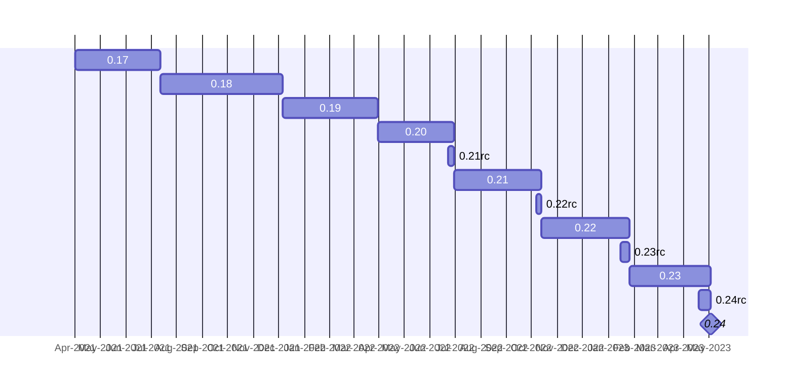

# Qiskit release cycle and versioning

| **Status**        | **Proposed/Accepted/Deprecated** |
|:------------------|:---------------------------------------------|
| **RFC #**         | ####                                         |
| **Authors**       | [Luciano Bello](https://github.com/1ucian0/)   |
| **Submitted**     | 2023-04-26                                   |
| **Updated**       | YYYY-MM-DD                                   |

## Summary
> One paragraph explanation of the feature.

Qiskit release cycle had been in a process of stabilization with planned minor releases.
Thinking in a "beyond 0.x", what kind of release cycle would provide users with the tools for planning and stability while reduce the impact in the development workflow.

## Motivation

> - Why are we doing this?
> - What will this enable?
> - What will be the outcome?
> - Who will benefit?

## User Benefit

> - Who are the target users of this work?
> - How will users or contributors benefit from the work proposed?

## Design Proposal
> This is the focus of the document. Explain the proposal from the perspective of
> educating another user on the proposed features.
> 
> This generally means:
> 
> - Introducing new concepts and nomenclature
> - Using examples to introduce new features
> - Implementation and Migration path with associated concerns
> - Communication of features and changes to users
> 
> Focus on giving an overview of impact of the proposed changes to the target
> audience.
> 
> Factors to consider:
> 
> - Performance
> - Dependencies
> - Maintenance
> - Compatibility

Currently 

## Detailed Design

> Technical reference level design. Elaborate on details such as:
> 
> - Implementation procedure
>   - If spans multiple projects cover these parts individually
> - Interaction with other features
> - Dissecting corner cases
> - Reference definition, eg., formal definitions.

## Alternative Approaches
> Discuss other approaches to solving this problem and why these were not
> selected.

## Questions
> Open questions for discussion and an opening for feedback.

## Future Extensions
> Consider what extensions might spawn from this RFC. Discuss the roadmap of
> related projects and how these might interact. This section is also an opening
> for discussions and a great place to dump ideas.
> 
> If you do not have any future extensions in mind, state that you cannot think
> of anything. This section should not be left blank.
