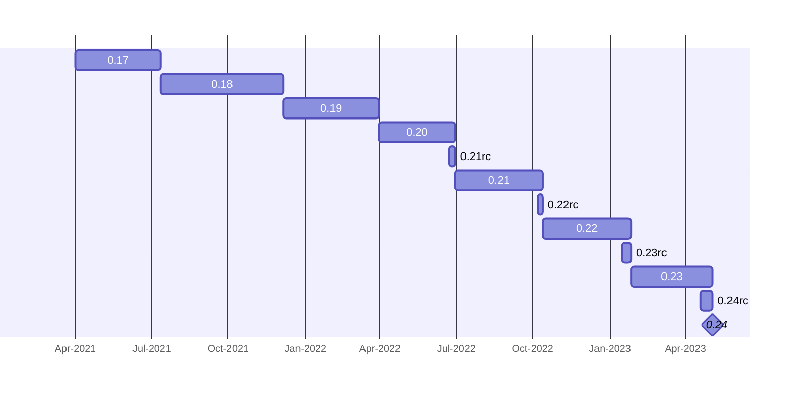
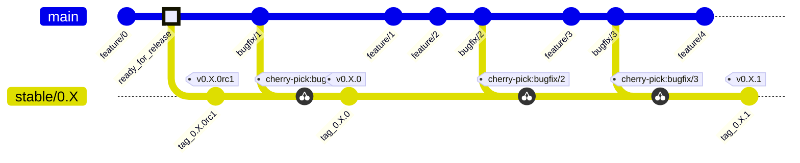
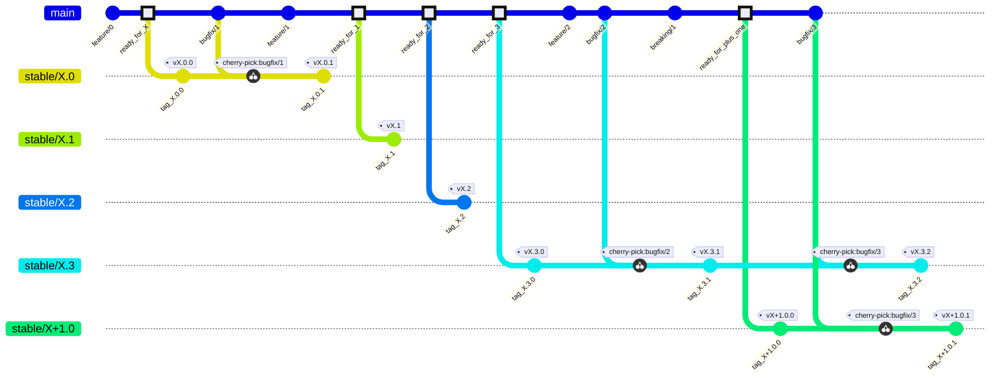

# Qiskit release cycle and versioning

| **Status**        | **Proposed/Accepted/Deprecated** |
|:------------------|:---------------------------------------------|
| **RFC #**         | ####                                         |
| **Authors**       | [Luciano Bello](https://github.com/1ucian0/)   |
| **Submitted**     | 2023-04-26                                   |
| **Updated**       | YYYY-MM-DD                                   |

## Summary

Balancing stable backward compatibility with the rapid pace of technology is a crucial consideration for Qiskit. This RFC is a public discussion that aims to find a harmonious solution that offers users a clear and transparent support contract while minimizing the burden on developers and users. Ideally, we are in  the search for an approach that also maximizes flexibility to accommodate new hardware and services, which often necessitate the development of new features.

## Motivation

Qiskit is known for its dynamic nature and frequent deprecation of features. However, it [deprecation policy](https://qiskit.org/documentation/deprecation_policy.html) places a strong emphasis on stability and guarantees a relatively lengthy transition period (usually longer than six months from the notification point on) when removing a feature. For the last years, Qiskit also introduced planned releases for mitigating the impact of coming changes, as well as pre-releases.

However, there is a demand for a more transparent release cycle with longer periods of backwards compatibility support. In order to get ready for a "beyond Qiskit 0.x", a discussion on how that cycle would like is key to understand the trade-offs among:

 * developer effort: Supporting several stable versions requires significant development resources. At the same time, rolling releases tend to create technical debt and few chance of rebuild from scratch particular modules. 
 * user support: users tend to demand longer support periods to avoid regular updates on their code and software.
 * new feature support for coming technology: the quantum computing field and hardware is in constant change and scaling to it many time requires big changes in Qiskit, not always compatible with previous approaches.

The outcome of the RFC is an agreement for release cycle and a versioning schema that would provide users with the tools for planning and stability while reduce the impact in the development workflow.

**out-of-scope**: 
The starting date for the implementation of this RFC is, in principle, outside the scope of this document.

## User Benefit

The RFC aims to benefit users and Qiskit ecosystem developers, because they will have guaranties that their software will run for a defined period of time and they could plan the transition period. 

## Design Proposal
<!--
> This is the focus of the document. Explain the proposal from the perspective of
> educating another user on the proposed features.
> 
> This generally means:
> 
> - Introducing new concepts and nomenclature
> - Using examples to introduce new features
> - Implementation and Migration path with associated concerns
> - Communication of features and changes to users
> 
> Focus on giving an overview of impact of the proposed changes to the target
> audience.
> 
> Factors to consider:
> 
> - Performance
> - Dependencies
> - Maintenance
> - Compatibility
-->

The current *0.** release cycle increases the minor version in approximate periods of 3 months on a scheduled basis and, with the exception of the pre-release period (from one to two weeks) does not support more than one stable version at the time, i.e. the support of `0.X` finishes with the release of `0.X+1`. 

The `0.*` branch scheme is like this:

The main branch is a single development branch from which some bugfixes are ported to the stable branch, from which releases are done.

The new release cycle could include:

 * [Semantic Versioning 2.0.0](https://semver.org/spec/v2.0.0.html)
 * Critical bugfix support for a year or longer
 * 6-month transition period for updating to a new major while having support.
 * Non-breaking new features in a 3-month cycle (as currently)

Notice that there is no i.4, since it coincides with i+1.0.

Similarly to the current branching model, non-breaking features (`feature/*`) and bug fixes (`bugfix/*`) can be merged into `main` at any point. Non-breaking features (`feature/*`) are released in minor releases, when branched out of `main` for `tag_X.*`. Bug fixes are cherry-picked from main into the respective `stable/X.*` branch.

The main difference with the 0.* schema is that breaking changes cannot be introduced at any point, but only between the release of X.3.0 and X+1.0.0 (between October and January).

## Detailed Design

> Technical reference level design. Elaborate on details such as:
> 
> - Implementation procedure
>   - If spans multiple projects cover these parts individually
> - Interaction with other features
> - Dissecting corner cases
> - Reference definition, eg., formal definitions.

### Deprecations and removals

* deprecation warnings cannot be introduced in patch releases
* deprecation warnings can only occur 1+ minor releases after the replacement functionality is added
* deprecation warnings must be emitted for a complete major version (i.e. 1+ year)

## Alternative Approaches
> Discuss other approaches to solving this problem and why these were not
> selected.

## Questions
> Open questions for discussion and an opening for feedback.

## Future Extensions
> Consider what extensions might spawn from this RFC. Discuss the roadmap of
> related projects and how these might interact. This section is also an opening
> for discussions and a great place to dump ideas.
> 
> If you do not have any future extensions in mind, state that you cannot think
> of anything. This section should not be left blank.
