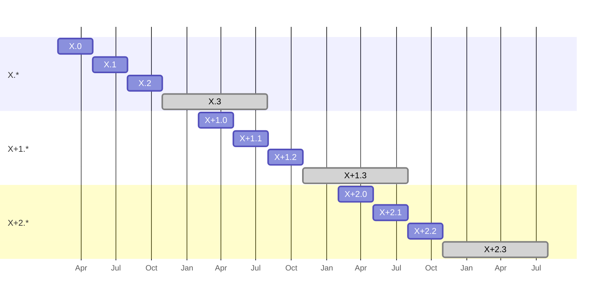

# Qiskit release cycle and versioning

| **Status**        | **Proposed/Accepted/Deprecated** |
|:------------------|:---------------------------------------------|
| **RFC #**         | ####                                         |
| **Authors**       | [Luciano Bello](https://github.com/1ucian0/) |
| **Submitted**     | 2023-11-21                                   |
| **Updated**       | YYYY-MM-DD                                   |

## Summary

Balancing stable backward compatibility with the rapid pace of technology is a crucial consideration for Qiskit. This RFC is a public discussion that aims to find a harmonious solution that offers users a clear and transparent support contract while minimizing the burden on developers and users. Ideally, we are in  the search for an approach that also maximizes flexibility to accommodate new hardware and services, which often necessitate the development of new features.

## Motivation

Qiskit is known for its dynamic nature and frequent deprecation of features. However, it [deprecation policy](https://qiskit.org/documentation/deprecation_policy.html) places a strong emphasis on stability and guarantees a relatively lengthy transition period (usually longer than six months from the first notification point on) when removing a feature. For the last years, Qiskit also introduced planned releases for mitigating the impact of coming changes, as well as pre-releases.

However, there is a demand for a more transparent release cycle with longer periods of backwards compatibility support. In order to get ready for a "beyond Qiskit 0.x", a discussion on how that cycle would like is key to understand the trade-offs among:

 * developer effort: Supporting several stable versions requires significant development resources. At the same time, rolling releases tend to create technical debt and few chance of rebuild from scratch particular modules. 
 * user support: users tend to demand longer support periods to avoid regular updates on their code and software.
 * new feature support for coming technology: the quantum computing field and hardware is in constant change and scaling to it many time requires big changes in Qiskit, not always compatible with previous approaches.

The outcome of the RFC is an agreement for release cycle and a versioning schema that would provide users with the tools for planning and stability while reduce the impact in the development workflow.

## User Benefit

The RFC aims to benefit users and Qiskit ecosystem developers, because they will have guaranties that their software will run for a defined period of time and they could plan the transition period. 

## Design Proposal
<!--
> This is the focus of the document. Explain the proposal from the perspective of
> educating another user on the proposed features.
> 
> This generally means:
> 
> - Introducing new concepts and nomenclature
> - Using examples to introduce new features
> - Implementation and Migration path with associated concerns
> - Communication of features and changes to users
> 
> Focus on giving an overview of impact of the proposed changes to the target
> audience.
> 
> Factors to consider:
> 
> - Performance
> - Dependencies
> - Maintenance
> - Compatibility
-->

The current *0.** release cycle increases the minor version in approximate periods of 3 months on a scheduled basis and, with the exception of the pre-release period (from one to two weeks) does not support more than one stable version at the time, i.e. the support of `0.X` finishes with the release of `0.X+1`. 

The `0.*` branch scheme is like this:

The main branch is a single development branch from which some bugfixes are ported to the stable branch, from which releases are done.

The new release cycle could include:

 * [Semantic Versioning 2.0.0](https://semver.org/spec/v2.0.0.html)
 * Critical bugfix support for a year or longer
 * 6-month transition period for updating to a new major while having support.
 * Non-breaking new features in a 3-month cycle (as currently)

Notice that i.3 has an extra 6 month bug fixing support. There is no i.4, since it coincides with i+1.0, where new features (and possibly breaking changes) are released.

Similarly to the current branching model, non-breaking features (`feature/*`) and bug fixes (`bugfix/*`) can be merged into `main` at any point. Non-breaking features (`feature/*`) are released in minor releases, when branched out of `main` for `tag_X.*`. Bug fixes are cherry-picked from main into the respective `stable/X.*` branch.

The main difference with the 0.* schema is that breaking changes cannot be introduced at any point, but only between the release of X.3.0 and X+1.0.0 (between October and January).

## Detailed Design

### Definition of *public API*

The Qiskit public API is considered
any documented module, class, function, or method that is not marked as private (with a `_` prefix). **All the stability guarantees are on these *public APIs* and users are encourage to only use them.**

**Exceptions**:

 - Experimental interfaces: If module, class, function, or method is documented as experimental that is not marked as private (with a `_` prefix). Experimental interfaces have to raise a user visible [Warning](https://docs.python.org/3/library/warnings.html) (exact Warning type to be define). 
 - Abstract interface definitions: These APIs are created to define an interface to be implemented by a subclass. Methods and properties defined as private in these Abstract classes are part of the public API.
 - Low-level methods for advanced usage: There are private methods that have stable interfaces but are not considered safe to use
as the burden is on the user to uphold the class/safety invariants themselves
(the canonical example of this is the `QuantumCircuit._append` method).

### Versioning Model

The proposed versioning model for Qiskit aligns with [Semantic Versioning 2.0.0](https://semver.org/spec/v2.0.0.html), providing a clear and standardized approach to version numbering. This model aims to communicate the nature of changes on the public API in each release, helping users and developers understand the impact of an update at a glance.

Semantic Versioning consists of three version components: *Major*, *Minor*, and *Patch* versions, represented as `X.Y.Z`. Each component has a specific meaning in the context of Qiskit:

**Major Version (X):** Increments for backward-incompatible changes, indicating potential breaking changes that may require modifications in user code using the public API. When a new major version `X` is released:

- There is a 18 month period for critical bugfixes.
- There might be non-breaking new features during that period.
- After 12 months `X+1` is released and a 6 month period for moving from `X` starts.
- After the release of `X+1`, `X` wont have new features and only critical bugfixes are provided.
- The features deprecated during the period of support with `X` will be removed in `X+1` 
After the release of a major version (X.3.0), a 6-month bugfix support period is provided to address critical issues, ensuring stability for users during the transition to the next major release (X+1.0.0).

**Minor Version (Y):** Increases for backward-compatible features or enhancements a new `X.Y` release:

- Users can expect new functionalities without breaking existing code (with the exception of Experimental APIs
- Deprecation of previous functionality might be introduced (with a `Deprecation Warning` and documentation), pointing to the new prefer way or alternative, if there is one.
- The support of `X.Y` finishes with the release of `X.Y+1` in most of the cases (exception might apply)

**Patch Version (Z):** Bumps for backward-compatible bug fixes.

- New `Z` releases have no scheduled and they are done on a *need-base* considering:
  - The *backportability* of the patch
  - The severity of the bug to fix
  - The criticality of the affected use-case
- Cannot be introduced in patch releases:
  - new deprecation warnings
  - new features of any kind
  - raise minimum requirements for using or building Qiskit (including adding new dependencies)
  - any kind of changes in any kind of public API (including Experimental APIs), including its removal or expansion.
- It may include:
  - expansive support for new versions of Python, Rust, or run/build environment
  - support for new versions of other existing dependencies
- The support of `X.Y.Z` finishes with the release of `X.Y.Z+1` (or `X.Y+1.0`) in most of the cases (exception might apply)
- After the release of `X+1`, bugfixing is provided via `X.Y.Z+N` in undetermined regularity for 6 months. 

### Git branching model

TODO

 * Removals/breaking changes can be PRed at any point against `next/X+1` branch.
 * Regularly, `main` should be merge into `next/X+1` to keep it up-to-date. The suggestion is for every minor release, at least.

 
### Suggested upgrade path

Users should upgrade minors and patch versions as soon as the next stable release happens in every case, except when there is a new major release.
Major releases allow for 6 months to transition from `X` to `X+1`.
Users and downstreamers should depend on `<X+1` until the end of the transition time.
The last minor on `X` is will contain all the `DeprecationWarning`s users should solve before moving on `X+1`.

If there is a dependency on a feature introduced in `Y`, users should depend on `>=X.Y,<X+1` (or `~=X.Y`). `DeprecationWarning`s introduced on `X.Y` will have an alternative path in `X.Y` and can be migrated then, when possible.

<!--
## Alternative Approaches
> Discuss other approaches to solving this problem and why these were not
> selected.

## Questions
> Open questions for discussion and an opening for feedback.

## Future Extensions
> Consider what extensions might spawn from this RFC. Discuss the roadmap of
> related projects and how these might interact. This section is also an opening
> for discussions and a great place to dump ideas.
> 
> If you do not have any future extensions in mind, state that you cannot think
> of anything. This section should not be left blank.
-->