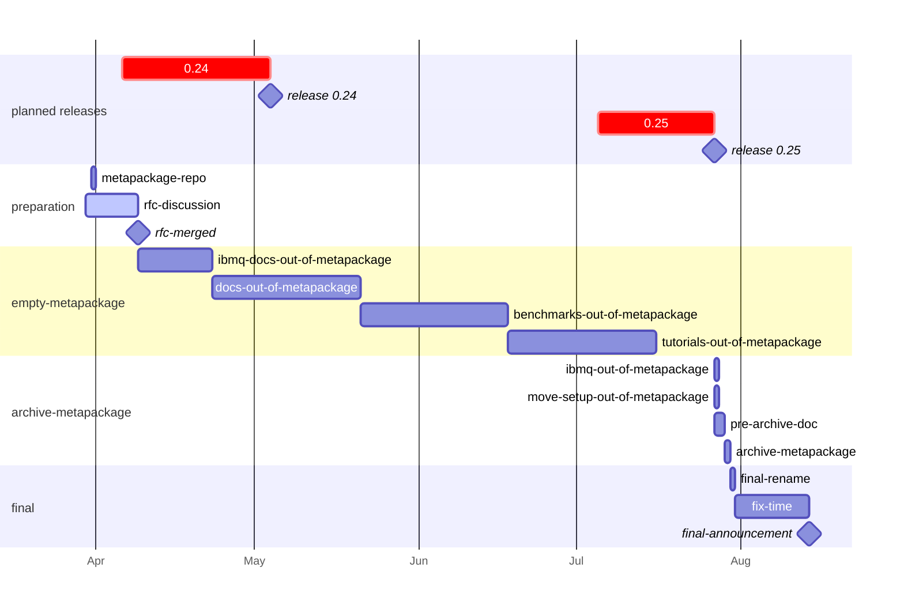

# Plan to rename `Qiskit/qiskit-terra` repo to `Qiskit/qiskit`

| **Status**        | **Accepted** |
|:------------------|:---------------------------------------------|
| **RFC #**         | 0011                                         |
| **Authors**       | [Luciano Bello](https://github.com/1ucian0), [Kevin Krsulich](https://github.com/kdk)  |
| **Submitted**     | 2023-03-31                                   |
| **Updated**       | 2023-05-10                                   |

## Summary
[In 2021](https://research.ibm.com/blog/qiskit-application-modules), Qiskit began an evolution from a large monolithic install, which included by default the Aer simulator, the IBM Quantum provider, and large characterization and application libraries, into a leaner and more modular structure.
The results of that progression are a Qiskit based on core components of circuit construction, compilation, and device interfaces, and a new [ecosystem](https://qiskit.org/ecosystem/) of extensions which users can explore, install, and contribute to based on their interests.

As Qiskit moved towards this leaner definition, the functionality in the current `qiskit-terra` has come to make up an increasing share of Qiskit's core.
However, having separate `qiskit` and `qiskit-terra` repositories results in additional indirection when, for example, trying to identify where users should submit an issue when encountering a problem in Qiskit, or where a particular piece of source code or infrastructure lives.

As a result, we are planning to rename the current `Qiskit/qiskit-terra` repository in GitHub as `Qiskit/qiskit`.
This document traces a plan for that renaming, including migration paths for all of the content currently in `Qiskit/qiskit`, both to inform the community about the potential for upcoming breaking changes, and to ask help identifying and defining mitigations for usages that may be impacted by this change.

## Motivation

This RFC seeks for the best way to mitigate the impact of current and future users brought on by the `Qiskit/qiskit-terra`-to-`Qiskit/qiskit` rename. Having a open an early discussion will help users to plan accordingly and express possible concerns and limitations.

## User Benefit

A more straightforward GitHub naming will help new users to navigate the complex Qiskit software ecosystem. However, it comes at the cost of disturbance to current users and developers. This RFC is a plan to reduce that disturbance as much as possible.

## Design Proposal

Renaming `qiskit/qiskit-terra` repository as `qiskit/qiskit` is problematic because the reutilization of the `qiskit/qiskit` repository namespace, currently used by the so called  *metapackage*.
To clarify the current usage of the `qiskit/qiskit` repository, it is straightforward to rename it something like `qiskit/qiskit-metapackage` which explains more clearly its purpose.
 
When renaming `qiskit/qiskit` to `qiskit/qiskit-metapackage`, GitHub automatically will redirect users `qiskit/qiskit -> qiskit/qiskit-metapackage` seamlessly. That rename does not "free" the `qiskit/qiskit` repository namespace. User might continue using `qiskit/qiskit` without noticing any change until `qiskit/qiskit-terra` gets renames as `qiskit/qiskit`.

**This proposal suggests to empty the current metapackage repository by distributing its content to other places. In this way, users and automation of the metapackage will slowly transition to other respective locations, minimizing the traffic to `qiskit/qiskit` that is expecting to find metapackage code. Once that is done, the metapackage can be archived and `qiskit-terra` can be renamed to `qiskit/qiskit`.**

However, this solution is not perfect.
There will be dangling instances that will continue pointing at `qiskit/qiskit` expecting to find `qiskit/qiskit-metapackage`.

Currently, the metapackage repository stores:

 * the `setup.py` for the metapackage
 * the documentation root `conf.py` for `qiskit.org/documentation` 
 * some documentation pages, like `Contributing to Qiskit`
 * the [benchmarking code](https://github.com/Qiskit/qiskit/tree/master/test/benchmarks) for <https://qiskit.github.io/qiskit/>
 * The ["global" Qiskit Code of Conduct](https://github.com/Qiskit/qiskit/blob/master/CODE_OF_CONDUCT.md). Practically, every Qiskit related repo points here. It needs to be copied to `qiskit/qiskit-terra` repo in order for links to still work after the rename.

This is the code that needs to be moved and distributed while their users, issues, and PRs, get transitioned to their new places.
This will be done in the main stage of the plan: empty-metapackage. This is the detailed timeline for each stage and task and their dependencies:

### preparation stage

This stage covers the pre-work with the following independent tasks:

 * **metapackage-repo**: Renaming `qiskit/qiskit` to `qiskit/qiskit-metapackage` is independently desired, as the new name describes more correctly its content.
 * **rfc-discussion**: During 10 days after the submission of this RFC, this document will collect comments and feedback on the best way to mitigate the effects of this renaming.

### empty-metapackage stage

The main stage of the plan is to empty the metapackage to minimize the traffic to `qiskit/qiskit` (at this point, `qiskit/qiskit-metapackage`) before the renaming `qiskit/qiskit-terra` to `qiskit-qiskit`.

For each task in this stage, the code is moved with related issues and PRs.
The tasks are independent and can start at any point, but they need to finish before the qiskit-terra release of July.

* **ibmq-docs-out-of-metapackage**: Early in the stage, we can try to deploy `qiskit-ibmq-provider` documentation as stand-alone in `qiskit.org/ecosystem/qiskit-ibmq-provider`. This is optional, as the full documentation will be removed on July.
* **docs-out-of-metapackage**: Move documents from `qiskit/qiskit-metapackage` to `qiskit/qiskit-terra`. All the ["general documents"](https://github.com/Qiskit/qiskit/tree/master/docs) in needs to be moved to the `qiskit/qiskit-terra` to be part of a single sphinx build process. The [`qiskit-ibmq-provider` documentation](https://qiskit.org/documentation/apidoc/ibmq-provider.html) cannot be move to `qiskit/qiskit-terra`. Therefore, the options are:
	* Wait until the stage ibmq-out-of-metapackage when the documentation can be removed as the repo `qiskit/qiskit-ibmq-provider` gets archived.
	* Create a landing page in `qiskit.org/documentation/ibmq-provider` or `qiskit.org/ecosystem/ibmq-provider` [like Aer did](https://github.com/Qiskit/qiskit-aer/pull/1589).  
* **benchmarks-out-of-metapackage**: The files in `test/benchmarks` construct <https://qiskit.github.io/qiskit/>. On this, there are the following options: (1) Create `qiskit/qiskit-benchmarks` or (2) move benchmark code `to Qiskit/qiskit-terra`. It is also possible to continue deploying the results in <https://qiskit.github.io/qiskit/>, in a different github page, or in <https://qiskit.org>.
* **tutorials-out-of-metapackage**: The tutorials from `qiskit/qiskit-tutorials` are deployed to the website from the metapackage. They were designed to cover more than "just terra" when Qiskit was associated with multiple elements. The discussion on where those tutorials should go is independent of this task, which is about deploying them as stand-alone documentation.

If users continue submitting issues on the metapackage for the moved parts, disabling issues for non-mainatainers is a last resort option.
Historically, the issue traffic is relatively low so probably no need for that. 

### ibmq-out-of-metapackage stage

The `qiskit-ibmq-provider` documentation cannot be move to `qiskit/qiskit-terra`.
In the [Qiskit release of July](https://github.com/Qiskit/qiskit-terra/milestone/30), the Qiskit metapackage only includes a single-dependency: `qiskit-terra` (without `qiskit-ibmq-provider` and `qiskit-aer`). The documentation The `qiskit/qiskit-ibmq-provider` repo is archived and the content associated with the `qiskit-ibmq-provider` package is removed from the metapackage (if it was not done before in empty-metapackage/ibmq-docs-out-of-metapackage)

### archive-metapackage stage

At this point, the traffic to `qiskit/qiskit-metapackage` (and, as a consequence, to `qiskit/qiskit`) is the minimum that can be archived. The `qiskit/qiskit-metapackage` repository is getting ready to be can be archived.

* **move-setup-out-of-metapackage**: Move metapackage setup.py to `qiskit/qiskit-terra`. The `qiskit/qiskit-terra` repo now build and publish the `qiskit` PyPI metapackage (with a single dependency) and the `qiskit-terra` PyPI package. 
* **pre-archive**: `qiskit/qiskit-metapackage` README file should link to the document in publish-plan stage, some instruction on how to navigate the history, and where the content is now. 
* **archive-metapackage**: Archive `qiskit-metapackage` repository.

### final stage

* **final-rename**: The `qiskit/qiskit-terra` repository is renamed to `qiskit/qiskit`. [Github automatically retires repos with more than one 100 clones](https://github.blog/2018-04-18-new-tools-for-open-source-maintainers/#popular-repository-namespace-retirement) and the metapackage `qiskit/qiskit` is borderline popular. Luciano contacted GitHub Support and open an heads-up ticket (`#2073453`). If `qiskit/qiskit` repository namespace gets retired at metapackage-repo stage, at this point the GitHub ticket needs to be pinged and manually un-retired.  
* **fix-time**: There might be some broken scripts to update and some users that might require support
* **final-announcement**: Blog post with announcement, covering the following items:

	*  Explain to qiskit users that now they are qiskit devs now
	*  "This clears up a lot of confusion"
	*  Maybe a YouTube video, as it might be relevant to a more broader audience

### Support channels
Besides the [regular support channels](https://qisk.it/support), affected users can:

 * ask questions in `#qiskit-repo-rename-support` in the [Qiskit Slack](https://qisk.it/join-slack).
 * Check FAQ in <https://github.com/Qiskit/feedback/discussions/categories/releases-roadmap>
 * Submit anonymous feedback to <https://qisk.it/feedback>

## Questions

**Why not manually moving `qiskit/qiskit-terra` code history, issues, and PRs to `qiskit/qiskit`?**

There is no easy way to move PRs in GitHub. It is technically harder than renaming. Additionally, instead of mainly affecting metapackage users, the change would affect more `qiskit/qiskit-terra` developers. The current plan preserves the workflow of qiskit-terra developers which significantly outnumber metapackage developers.

## Future Extensions

After archive-metapackage/move-setup-out-of-metapackage, the versions for packages `qiskit` and `qiskit-terra` are equalised and can be released at once and as one. This is planned for October release.
