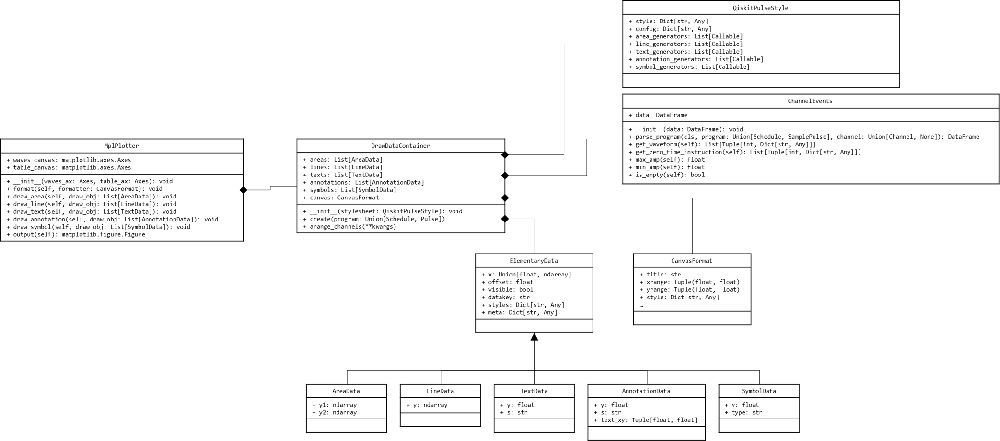

# Scalable Pulse Drawer

| **Status**        | **Proposed** |
|:------------------|:---------------------------------------------|
| **RFC #**         | ####                                         |
| **Authors**       | Naoki Kanazawa (knzwnao@jp.ibm.com)    |
| **Deprecates**    |                  |
| **Submitted**     | 2020-05-01                                   |
| **Updated**       | 2020-05-21                                   |


## Summary
The pulse drawer is one of the best ways to debug pulse programs. However, it is not very user-friendly.
We propose a new drawer implementation that should improve usability and lead to improved pulse programming efficiency.
In the new implementation, the style sheet feature is leveraged to reduce the required amount of code to generate good visualization and the internal representation (IR) of drawing data is introduced to handle multiple drawing backends under the drawer framework.

## Motivation
In the conventional pulse drawer, we call v1 hereafter, the minimum amount of code to generate a readable pulse visualization is:
```python
pulse_drawer(
    my_sched,
    label=True,
    plot_range=(0, 2000),
    channels=[pulse.DriveChannel(0), pulse.DriveChannel(1), pulse.MeasureChannel(0), pulse.MeasureChannel(1)]))
```
Users must write this boilerplate code for every pulse program they wish to draw.
In addition, the v1 drawer has several defects in the output format.
The drawer aranges pulse channels in the order of `[DriveChannel[i], ControlChannel[i], MeasureChannel[i], AcquireChannel[i]] for i in range(max_channel_index)` (or `'channel-index-wise'`) but in IBM Quantum backends the index `i` of `ControlChannel` doesn't indicate the index of corresponding qubit.
For example, when we visualize a pulse schedule that includes a cross resonance pulse on qubit 15, the corresponding `ControlChannel` index may be 36 and the cross resonance pulse is drawn at the place far below the `DriveChannel`s of this qubit.
This makes the debugging of the program very hard.
Another defect can be seen when we try to visualize two pulses whose durations are very much different.
A good example is a single qubit pi pulse followed by a measurement stimulus pulse.
Usually a pi pulse duration is around 160 cycles whereas that of the measurement pulse is over 10000.
Currently, we can truncate the measurement pulse with the `plot_range` option.
However, when we enable conditional gates or a conditional reset in the middle in the schedule, the truncation by `plot_range` doen't work becase users may also want to know the pulse sequence after the measurement stimulus.
There is another frustrating situation based on our experience. When we wrote the [Qiskit Pulse paper](https://arxiv.org/abs/2004.06755) we needed to modify the drawer itself to address reviewer's requests and we decided not to share the code for pulse drawing in the public database.
Having configuration be based on a style sheet will help us in such a situation because we would just need to create a dedicated style sheet for publication and share the style sheet instead of modifying source code.

From the point of view of contributors, the current drawer is implemented as one large function call and it is very hard to maintain.
Sometimes a change in the Qiskit Pulse module may cause an unexpected error in the drawer or even crash it, but this will not be detected because visualization level tests are currently skipped now.
Moreover many contributors don't update reference figures in the unittest folder.
Thus, it is better to decompose this huge callback function into some unit functions and enable unit tests for those functions which don't deal with `matplotlib` objects.

This update will improve the efficiency of pulse programming and maintainability of code.

## User Benefit
Every Qiskit Pulse user will enjoy the benefit. From novice to the professional level, users will be able to get a readable visualization with a more simple function or method call for debugging purposes and then easily customize the output format for publication.
Cost of code maintainance will be also decreased.

## Design Proposal
The heart of new design concept is the simplification of the function call while keeping sufficient customizability using style sheets.
The style sheet is defined as a class `QiskitPulseStyle` and Qiskit provides users with a set of functions that configure the class instance.
New style sheet can contain python callback function to contol drawing data.

In addition, we are willing to develop an intaractive drawer to visualize very long pulse sequences such as dynamical decoupling.
Although there are several candidates of drawing backend, we plan to use [Bokeh](https://docs.bokeh.org/en/latest/index.html) in parallel with matplotlib in future extensions because of its flexibility of interface (see [Future Extensions](#Future-Extensions)).
Because the v1 drawer is designed to use matplotlib, it is not easy to switch drawing backend due to the mismatch of API.
Following to the discipline "_a graph can be represented as a dictionary-like object_", i.e. collection of data, coordinate, style info, etc..., here we propose to introduce the IR of drawing objects.
In other interactive drawers such as [Bokeh](https://docs.bokeh.org/en/latest/index.html) and [Plotly](https://plotly.com/python/) a drawing object is first represented as a pandas [DataFrame](https://pandas.pydata.org/pandas-docs/stable/reference/api/pandas.DataFrame.html) within its python environment, then their actual drawing engine written in JavaScript handles the drawing data.
In this way, they can seamlessly connect different APIs while separating the data preparation layer and the drawing layer.
This also benefits unittest because the data preparation layer is free from drawer dependency.
We migrate this workflow in new pulse drawer, or v2 drawer, and we use dedicated python classes as the drawing object IR to deal with complicated pulse programs with the aid of metadata.
Eventually, the python class will be replaced by [dataclass](https://docs.python.org/3/library/dataclasses.html) that is available only on python 3.6 (backported) and over 3.7.

In the v2 drawer, a user will call the drawer in the following manner:

```python
import qiskit.visualization.pulse_style_lib

schedule_drawer(
    my_sched,
    style=pulse_style_lib.iqx_debugging())
```

The `pulse_style_lib` will contain several predefined style sheets that have different visualization purposes.
In the above example, `iqx_debugging()` is a function call which generates a style sheet class instance.
This style sheet is expected to show as much information as possible, i.e. pulse name, operand values of `PhaseShift` and `FrequencyShift`, pulse peak height, pulse duration and so on.
If that information is too much for publication, the user can switch the output format by using another style sheet:

```python
import qiskit.visualization.pulse_style_lib

schedule_drawer(
    my_sched,
    style=pulse_style_lib.iqx_publication())
```

The `iqx_publication` style sheet may show only pulse names and frequency values because other information will appear in the pulse envelope.
Pulse names may be reformatted into LaTex syntax, for example, systematic name `X90p_d0_123456789` is replaced by `$X_{90}$` by using regular expression operation (This is one of what we needed to do in the [Qiskit Pulse paper](https://arxiv.org/abs/2004.06755)).

As those examples illustrate, we can easily change the data to be overlayed on the plot by using style sheets.
The layout of channels and truncation of pulses are also controlled by the style sheets.
In `iqx` style sheet series, preferred channel layout must be `[DriveChannel[i] for i in range(max_channel_index)], [ControlChannel[i] for i in range(max_channel_index)], [MeasureChannel[i] for i in range(max_channel_index)], [AcquireChannel[i] for i in range(max_channel_index)]` (or `'channel-type-wise'`), and `'truncation': True` (automatically truncate long pulse and delay).

The drawer takes those style sheets for controlling information to show, channel layout and truncation.
However users are still able to overwrite all drawing options on the spot with `**kawgs` to focus on the waveforms they want to check.
Thus, new drawer interface becomes:

```python
def schedule_drawer(
  program: ScheduleComponent,
  dt: int = 1, # time resolution
  style: SchedStyle = None, # style sheet instance
  filename: str = None, # if set save the plot in file
  waves_ax: matplotlib.Axes = None, # object to draw pulses
  table_ax: matplotlib.Axes = None, # object to draw event table
  **kwargs # data controls
):
```

For visualization of `SamplePulse` we will create another dedicated interface because it requires fewer numbers of arguments:

```python
def sample_pulse_drawer(
  program: SamplePulse,
  dt: int = 1, # time resolution
  style: PulseStyle = None, # style sheet instance
  filename: str = None, # if set save the plot in file
  pulse_ax: matplotlib.Axes = None, # object to draw pulses
  **kwargs # data controls
):
```

Note that the new drawer interface takes `matplotlib.axes.Axes` objects.
This is important feature from the publication viewpoint, because users may want to compare two different pulse schedules aranged in column-wise or row-wise.

Contributors must pay attention not to increase the number of arguments of this inteface otherwise the simplifity of function call will be lost and such PR will eventually decrease the efficiency of pulse programming.
Instead of adding new argument to the interface, contributors can add new options to the `QiskitPulseStyle` and callback functions of predefined style sheets.

Implementation details are described in next section.

## Detailed Design



Here we show the UML class diagram of v2 drawer.
The `DrawDataContainer` class is a collection of drawing object IR (`ElementaryData`) and `CanvasFormat`. Those are implemented as dedicated python class that consist of information and its coordinate or sample array, generic style information, and metadata of the object. The metadata contains, for example, operands of the pulse instraction which may be shown in a hover window by mouse over in the interactive mode.

This data container is initialized with stylesheet and data is added by calling `.create` method with pulse program.
When pulse program is updated, we can update the container by calling the method.
This may enable to track a pulse program and dynamically update the output figure with event handler.
Another important method is `.arange_channels`, which updates auxiliary information, namely `visible` and `offset`, of drawing object IR.
In the interaction mode, it is expected to turn on and off specific type or specific channels by clicking widget buttons.
This can be easily implemented by calling `.arange_channels` method.

In v2 drawer, we expect to have five kinds of drawing objects:

- `AreaData`: Used to draw filled line. Mainly used for waveform visualization.
- `LineData`: Used to draw simple line. Mainly used for baseline visualization.
- `TextData`: Used to draw text object. Visualize channel alias, scaling value, pulse name and so on.
- `AnnotationData`: Used to draw annotation object. Show text with pointer arrow.
- `SymbolData`: Used to draw symbols. Mainly used for visualization of zero-time instruction symbol.

Because data structure of those object is different, dedicated python classes are defined by inheriting from `ElementaryData`.
The `CanvasFormat` is general format information for the drawing canvas including figure title and plot range.

At the level of `DrawDataContainer`, there is no difference between `Schedule` and `SamplePulse` because the class represents just a collection of what the drawer need to draw.
However, due to complexity of data, converting the `Schedule` into drawing object IR is not straightforward.
To support this workflow, `ChannelEvents` class is introduced by updating existing `EventsOutputChannels`.
This class is initialized by class method

```python
events = ChannelEvents.parse_program(sched, pulse.DriveChannel(0))

events = ChannelEvents.parse_program(sample_pulse, None)
```

The `.parse_program` method parses the given program (either `Schedule` or `SamplePulse`) and creates `ChannelEvents` instance with its instruction list represented by `DataFrame`.
Thus `DrawDataContainer.creates()` internally generates `ChannelEvents` instances to parse the program and outputs drawing object IRs.
Because we have five kinds of IRs, we need five types of generator functions.
These generator functions are specified by a list in `QiskitPulseStyle` as `List[Callable]`.
If the style sheet is design to show both pulse names and channel aliases, we can add two callback functions for `TextData`.

The v2 style sheet `QiskitPulseStyle` consists of three parts.
The `style` is the simple version of [rcParam](https://matplotlib.org/3.2.1/tutorials/introductory/customizing.html) in matplotlib which just controls the appearance of figure.
Thus, this field is just embedded to the drawing object IRs and passed to the drawing backend.
The `config` gives default parameters of data control, such as truncation, channel layout, scaling, and channel types to show.
This field controls the data in the `DrawDataContainer` and can be overwritten by drawer interfaces.
In addition to them, there are five lists of callback functions to generate drawing object IRs.
Some of typical functions are provided by Qiskit, but the user is also able to write custom generator and append it to own style sheet.

Note that all of above functionalities are decoupled from the actual drawing backend.
This enables us to implement sufficient unittest for them within the current testing framework.
On the other hand, the actual drawing backend is also decoupled from the Qiskit Pulse framework.
Therefore we can minimize the impact of code change to the core drawing functionalities.

The `MplPlotter` interfaces `DrawDataContainer` and matplotlib.
This receives a list of `ElementaryData` and plots all of them on its canvas.
We plan to add the interactive drawer built upon Bokeh in future extensions.

The entire work can be separated into several small PRs.

### Phase1: Add `ChannelEvents`
This is fundamental object to convert pulse program into drawing object IR.
Thus this should be implemented first.
This class has unittest.

### Phase2: Add drawing object IRs
This is another fundamental object composing `DrawDataContainer`.
`.create` and `.arrange_channels` method can have unittest.

### Phase3: Add `QiskitPulseStyle`
Because stylesheet contains IR generators, we need to implement this class on top of the drawing object IRs.
Because this class just keeps setup data, unittest is not necessary.

### Phase4: Add style sheet library and IR generators
Here we prepare `iqx_debugging`, `iqx_publication` and `iqx_standard` in the Qiskit provided style sheet library.
The preset IR generators will be

- `gen_waveform`: output `AreaData` of pulse envelope
- `gen_baseline`: output `LineData` of zero line of each channel
- `gen_boundary`: outout `LineData` of pulse boundary
- `gen_pulse_labels`: output `TextData` of pulse names
- `gen_latex_pulse_labels`: output `TextData` of pulse names in Latex format
- `gen_channel_names`: output `TextData` of channel names
- `gen_scales`: output `TextData` of channel scale values
- `gen_pulse_height`: output `AnnotationData` of maximum and minimum pulse height.
- `gen_freq_value`: output `AnnotationData` of frequency change value
- `gen_phase_value`: output `AnnotationData` of phase change value

IR generators have unittest.

### Phase5: Add `DrawDataContainer`
This class has dependency on other classes developed in previous phases.
This class has unittest.

### Phase6: Add `MplPlotter`
Since this class has matplotlib dependency, we cannot test this class under the current testing framework.

### Phase7: Add interface function
The interface function generates `DrawDataContainer` from a given pulse program and generate a figure with `MplPlotter`.
Since the output of this function is matplotlib object, we cannot test this function under the current testing framework.

## Alternative Approaches
N/A

## Questions
None

## Future Extensions
In future extensions, we plan to add the interactive drawer on top of Bokeh.
The output figure of Bokeh forms a simple widget, in which we can zoom and scroll the output image.
This is very effective to debug very long pulse sequences such as dynamical decoupling.
It provides some additional widgets like a hover window that enables to show all details of the instruction in the same figure.
Those functionalities further improves efficiency of pulse coding by saving us from having to write tons of code to check details of instructions residing in a pulse programs.

If the program is running on the jupyter notebook, we can combine [ipywidget](https://ipywidgets.readthedocs.io/en/latest/) to give dynamic controllability of the output image through buttons, pulldown menues, scroll bars, etc...
For example, we can disable showing acquire channels and switch style sheets without restarting the drawer.
Although Bokeh provides such custom widgets, it requires to [hardcode JavaScript as python string](https://docs.bokeh.org/en/0.12.0/docs/user_guide/interaction.html#userguide-interaction-actions-widget-callbacks
).
This is unfavourable in terms of code maintainance, thus we may take an approach of using Bokeh + ipywidget to implement the fully interactive drawer in pure python.

In the v2 drawer framework, we can easily switch the drawing backend without breaking the codebase.
We can prepare `BokehPlotter` class that interfaces `DrawDataContainer` and Bokeh + ipywidget.
