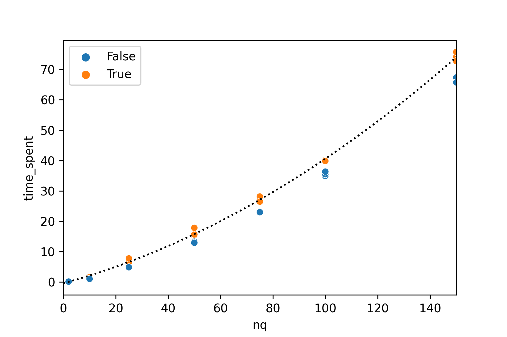
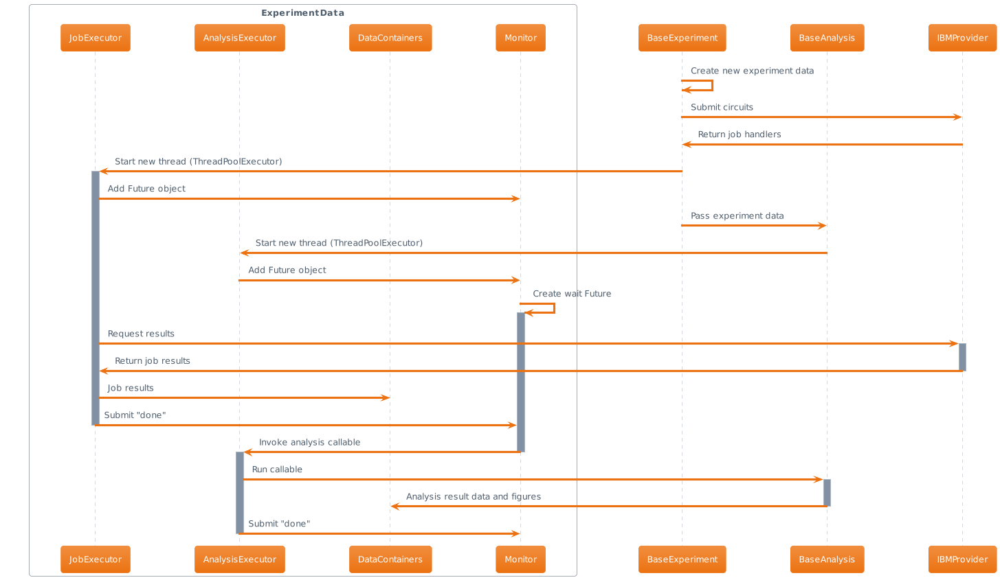
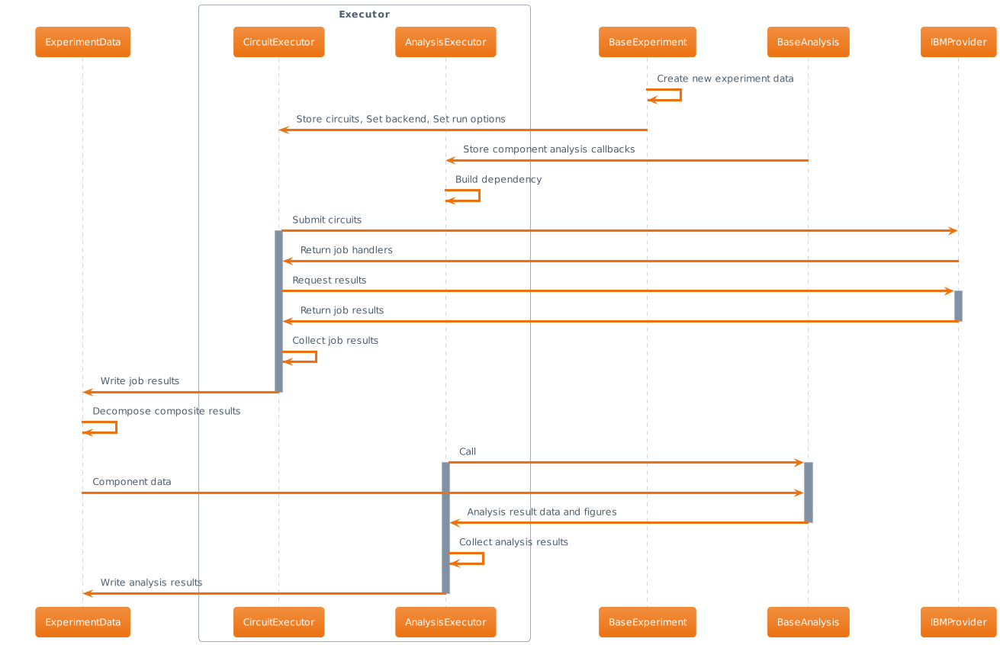
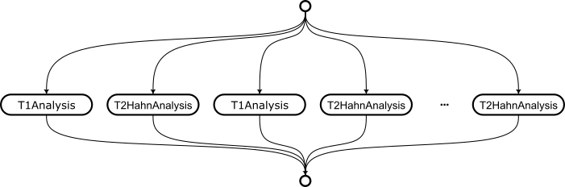
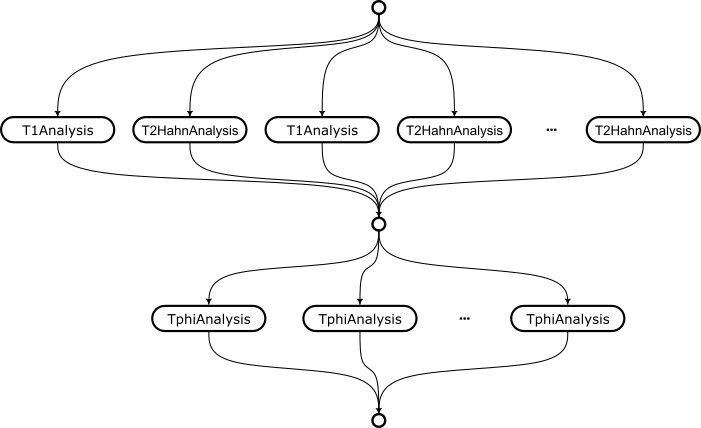

# Overhaul Qiskit Experiments

| **Status**        | **[Not planned](https://github.com/Qiskit/RFCs/pull/73)** |
|:------------------|:-----------------------------------------|
| **RFC #**         | 0014                                     |
| **Authors**       | Naoki Kanazawa (nkanazawa1989@gmail.com) |
| **Deprecates**    | N/A                                      |
| **Submitted**     | 2023-08-23                               |
| **Updated**       | 2023-09-12                               |

## Summary

[Qiskit Experiments](https://github.com/Qiskit-Extensions/qiskit-experiments) (QE) is a qiskit extension project that provides a basic framework 
for calibration and characterization experiments together with the built-in experiment library.
The ultimate goal of this project is the enablement of maintenance workflow for a utility-scale quantum processors, which may consist of 
few hundreds or maybe thousands of qubits.
This document spots current performance bottlenecks and describes how to overcome the performance issues.

As described in the [project documentation](https://qiskit.org/ecosystem/experiments/tutorials/intro.html#what-is-qiskit-experiments), QE consists of
three major components, and a developer will subclass these components to define a workflow tailored to their quantum processor.

- [Experiment](https://github.com/Qiskit-Extensions/qiskit-experiments/blob/main/qiskit_experiments/framework/base_experiment.py) Class: Defines the quantum circuits and runs them on the processor.
- [Analysis](https://github.com/Qiskit-Extensions/qiskit-experiments/blob/main/qiskit_experiments/framework/base_analysis.py) Class: Consumes experiment results and generates analysis results.
- [ExperimentData](https://github.com/Qiskit-Extensions/qiskit-experiments/blob/main/qiskit_experiments/framework/experiment_data.py) Class: Stores experiment results and analysis results.

A typical workflow to run a single experiment would look like:

**Example1: T1 experiment on a single qubit**
```python
from qiskit_experiments.library import T1
import numpy as np
from qiskit_ibm_provider import IBMProvider

# (step1) Load backend
provider = IBMProvider()
backend = provider.get_backend("ibm_xyz")

# (step2) Define experiment and run
exp = T1(physical_qubits=(0,), delays=np.linspace(0, 300e-6), backend=backend)
exp_data = exp.run()

# (step3) Wait until experiment completes
exp_data.block_for_results()

# (step4) Save results in remote storage (optional)
exp_data.save()
```

This lines of code show a procedure to run the inversion recovery experiment on the qubit 0 of some IBM device `ibm_xyz`.
In a practical maintenance workflow, one must run this experiment for all qubits on `ibm_xyz`.
This can be done by creating a `ParallelExperiment` instance.

**Example2: T1 experiment on multiple qubits**
```python
from qiskit_experiments.framework import ParallelExperiment

exp = ParallelExperiment(
  [
    T1(physical_qubits=(q,), delays=np.linspace(0, 300e-6)) 
    for q in range(backend.num_qubits)
  ],
  backend=backend,
)
exp_data = exp.run()
```

A component experiment (`T1`) creates M circuit, and the parallel experiment is defined for N qubits.
In principle number of task for this experiment is M*N, but the parallel experiment digests N circuits of the components and
creates a single merged circuit to run. Thus number of actual payload is always M, regardless of qubit number.
It seems like QE framework is syntactically scalable, however, data analysis overhead will almost monotonically increase with N in the current implementation.

Although circuit generation cost and communication overhead are also significant, we should focus on analysis task in this RFC document.
This is because circuit generation heavily relies on the core [Qiskit](https://github.com/Qiskit/qiskit-terra) package, 
and communication overhead depends on the payload format that [Provider](https://github.com/Qiskit/qiskit-ibm-provider) defines (currently IBM uses QPY binary format).
Especially, we put attention in the [curve analysis](https://github.com/Qiskit-Extensions/qiskit-experiments/tree/main/qiskit_experiments/curve_analysis) module,
because almost all experiments in the maintenance workflow require parameter scan and fitting to find an optimal control parameter or device parameter as shown in above example.

## Motivation

The plot below shows wall clock time (with and without plotting the Matplotlib figure) for running parallel T1 analysis against number of qubits on my laptop; MBP Intel Core i7 @ 2.3 GHz (4 cores), 32 GB Mem.
As shown in this experiment result, required time increases roughly quadratically with qubit number.
To run a single experiment on few hundreds qubit device (such as IBM Osprey processor), it would take 10s minutes to get analysis results.
This is non-negligible downtime for a quantum computing system because the system calibration workflow often consists of [dependent tasks](https://arxiv.org/abs/1803.03226),
and the following experiment run might be on hold until predecessor results become available.



(see [this gist](https://gist.github.com/nkanazawa1989/41428cd21b7307a70be720779b364ca3) for more details.)

I also scrutinized the performance of the current framework with a statistical profiler.
Since the percentage of function detection varied significantly from run to run, I only show qualitative results here.
I found following subroutines tend to frequently show up in the frame graph.

#### Initialization of `ExperimentData` sub-container

Because composite analysis needs to instantiate new data container to run component analyses,
calling the constructor of this expensive class consumes significant time in heavily batched experiment.
Especially, acquisition of a service object and qiskit version information is the expensive part.
Since such information is not necessary for inner (child) data container, we can replace `ExperimentData`
with much lightweight data container to alleviate this overhead. See the following discussion for details.

#### Marginalization of the result count

When parallelize the experimental circuits, the measured count dictionary is keyed on the
merged bit string of all measurements in sub experiments.
The max length of the dictionary scales with O(n2) with qubit size, and actual size 
may increase with shot number. Since the marginalization function is already implemented in Rust,
we need to reduce number of call to this function.

#### Creation of curve-fit figures

When we run a curve analysis, the analysis will generate a matplotlib figure to interact with human experimentalists.
This subroutine is also expensive. Fortunately we can set `plot=False` in the analysis options
if figure is not necessary. 
Experimentalist will be able to load raw data points from the experiment service at later time (not supported as of QE 0.5). 

#### Curve fitting

This is not significantly slow but the overhead is visible. It also may depend on the analysis.
Some analysis provide multiple initial guesses for the fit model parameters,
and the fitter is called many times for each guess values.


## User Benefit

A user or system agent who heavily rely on the parallel or batch execution feature will dramatically benefit from this overhaul. 
These users typically be a responsible for the system deployment or maybe a researcher who benchmarks a novel gate with larger application circuits. 
This kind of work requires users to run a chain of calibration and monitoring experiments at a scale of the quantum processor.
If experiments are conducted in the dedicated queue mode or with a [runtime in a session](https://qiskit.org/ecosystem/ibm-runtime/how_to/run_session.html), 
the significant overhead in the local analysis task may also deteriorate the machine efficiency of the remote quantum computing system.

With the proposed overhaul plan, we aim to achieve the T1 analysis wall time of < 5 sec at nq=100 either with a high-end laptop or workstation (sorry we don't have proper benchmark suite for QE!).
I think this is a feasible and good target number to motivate experimentalist to employ QE for a practical work.

## Design Proposal

### Performance bottleneck of current framework

Performance bottleneck mainly comes from the design of the `ExperimentData` class. 
This class was originally designed as a bridge between IBM provider and Experiment service, where we submit jobs to and later save the analysis results in, respectively.
Therefore, the class implements multithreading to query the provider for the job results, and also an interface to the experiment service.

Although this class is tightly coupled to remote server, local QE workflow also heavily relies on the experiment data, 
namely, the experiment data receives job objects from the experiment class, waits for the job results, invokes the analysis callbacks on the results,
collects outcomes from the callbacks and finally stores them in the experiment service.
The internal flow of experiment run is simplified to some extent and shown in the diagram below.



As you find, `ExperimentData` is more than a data container, and indeed this is executor + data container and too complicated to maintain.
If you are familiar with [concurrency](https://docs.python.org/3/library/concurrent.futures.html), you may know there are two different implementations; 
multithreading and multiprocessing.
For IO-bound tasks like waiting for job results, multithreading is effective approach. 
On the other hand, for CPU-bound tasks like running analysis, multiprocessing is more effective.
In Python (CPython), we have the [global interpreter lock](https://peps.python.org/pep-0703/) (GIL) mechanism (in future the [GIL could be removed](https://peps.python.org/pep-0703/)),
and under the lock only single thread can access Python object at a time.
Although the core of the curve fitting analysis is implemented by NumPy which [can release GIL](https://superfastpython.com/numpy-vs-gil/),
still data management in QE analysis relies on the custom Python data structure and thus gain from multithreading is a little.
However, due to the tight coupling between data container and executor in the experiment data class, it's not easy to simply use multiprocessing.
In multiprocessing, objects under manipulation are duplicated in each subprocess through pickle, and thus analysis results collected by the experiment data instance
in a subprocess are immediately discarded after the subprocess finishes.
Instead of mutating the copied container, the analysis callback must return resulting data to the main process.

### Specific problems in composite analysis

Composite analysis is a wrapper of a list of analyses, that is used internally by the [ParallelExpeirment](https://github.com/Qiskit-Extensions/qiskit-experiments/blob/main/qiskit_experiments/framework/composite/parallel_experiment.py)
and [BatchExperiment](https://github.com/Qiskit-Extensions/qiskit-experiments/blob/main/qiskit_experiments/framework/composite/batch_experiment.py).
Because these are the key elements to build a practical workflow for the maintenance of quantum processors, 
improvements in the composite framework will dramatically improve the target user's experience.
As shown in the Example2, the composite experiment is created with a list of experiment instance, and an experiment instance is defined per a
single set of qubit and single kind of experiment, e.g. T1 experiment on qubit 0. The composite experiment will create a composite analysis on the fly by consuming the
analysis instance attached to each experiment instance.
Once a composite job completes, composite analysis will spawn subset `ExperimentData` (i.e. child data) by splitting the result data into each container.
This process is done by a [`marginal_distribution`](https://github.com/Qiskit/qiskit-terra/blob/7bc2bfd4f8dcc436aec5f85641e3ec07be15eb01/qiskit/result/utils.py#L199-L203) function in Qiskit.
For example, if the job result is a count dictionary `{"00": 100, "01": 200, "10": 300, "11": 400}`, the result for the subset experiment 1 
is `{"0": 400, "1": 600}`, and one for experiment 2 is `{"0": 700, "1": 300}`. 
With these two sub-dictionaries, the composite analysis creates two experiment data containers and run component analysis on them.
This mechanism allows us to reuse the rest of analysis logic written for a single set of qubit, for system-scale analysis.
Execution of each analysis task called by the composite analysis is controlled by the outermost experiment data container fed into the composite analysis.
The composite experiment can be nested into another composite experiment, and this flexibility allows us to build a complicated experiment pattern that 
experimentalist or system administrator might be interested in. 
For example, if you want to [measure the pure dephasing rate](https://www.nature.com/articles/s41534-019-0168-5) of multiple qubits, 
you need to batch T1 and T2 experiment, and broadcast the batched task on multiple qubits. 
This setup can be written as a parallel of a batch experiment, or vise versa.

The idea of experiment parallelism is sophisticated but there are several issues from both capability and performance viewpoint.
These points might be summarized with following three implementation defects.

#### 1. Owner of the marginalization responsibility

Currently, decomposition of a batched experiment result (i.e. `marginal_distribution` function) is run by the composite analysis.
This indicates a user cannot obtain the result data for a particular experiment until running the composite analysis for whole experiment results.
This hurts usability. 
For example, an experimentalist may find a couple of unexpected analysis results out of a large number of batched results.
Even if they want to rerun analysis only on failed instances, they need to handcraft another composite analysis instance with an entire list of analyses.
They need to identify the index of the analysis of interest if one wants to try different fitting options.
Instead, delegating the marginalization responsibility to `ExperimentData` will simplify the workflow as follows.

**Example3: Rerunning a partial component analysis**
```python
exp_data = ExperimentData.load(exp_id, service=experiment_service)
sub_data = exp_data.child_data(experiment="T1", qubits=(0,))  # Not supported.

T1Analysis().run(sub_data, replace_results=True)
```

In addition, the `marginal_distribution` function is [repeatedly called](https://github.com/Qiskit-Extensions/qiskit-experiments/blob/c66034c90dad73d705af25be7e9ed9617e7eb2ef/qiskit_experiments/framework/composite/composite_analysis.py#L222-L226) for each component register index in the current implementation,
this induces heavy dictionary manipulation overhead in the composite analysis.

#### 2. Callback running callbacks

In QE analysis, an experiment developer needs to provide implementation of the [`_run_analysis`](https://github.com/Qiskit-Extensions/qiskit-experiments/blob/c66034c90dad73d705af25be7e9ed9617e7eb2ef/qiskit_experiments/framework/base_analysis.py#L228-L231) method
where the analysis digests the experiment results and returns a set of analysis results. 
This method is passed to the thread executor in the experiment data as a callback, and runs concurrently with other component analyses.
The composite analysis also implements this method, in which the [composite analysis callback invokes multiple threads](https://github.com/Qiskit-Extensions/qiskit-experiments/blob/c66034c90dad73d705af25be7e9ed9617e7eb2ef/qiskit_experiments/framework/composite/composite_analysis.py#L130-L133) for underlying component analysis callbacks.
Since composite analysis can be nested, this structure requires recursive thread/process pool management, which is likely unmanageable.

#### 3. Initialization of the expensive data container

Because `_run_analysis` method takes `ExperimentData` instance, the composite analysis needs to instantiate this expensive data container many times
although running analysis only requires experiment results (such as count dictionary) and metadata involving the setting of experiment.
The interface to the experiment service is not necessary at all for analysis, and thus we can define more lightweight container.


### Improvements in unit analysis

Since 1-D parameter scan followed by a curve fitting is the most popular pattern in our experiments, QE provides the [`CurveAnalysis`](https://github.com/Qiskit-Extensions/qiskit-experiments/blob/main/qiskit_experiments/curve_analysis/curve_analysis.py) baseclass,
so that an experiment developer can quickly write new analysis only by defining a fitting model and initial guess for the model parameters.
Indeed, most calibration and maintenance experiments subclass the curve analysis baseclass. 
That is to say, even small improvements will appear as a cumulative performance improvements in the heavily batched experiments.

The subroutines with the significant execution time in the curve analysis are the curve fitter and figure drawer.
QE uses the [LMFIT](https://lmfit.github.io/lmfit-py/) for curve fitting, which is basically a wrapper of the [Scipy Optimize](https://docs.scipy.org/doc/scipy/tutorial/optimize.html).
By default, we use the `least_square` minimizer to minimize the residual of the fit curve.
This optimizer is not quite slow, but it still requires numerically computed Jacobian matrix for parameter update.
[JAX](https://jax.readthedocs.io/en/latest/index.html) provides a framework for JIT compilation and auto-gradient of a numpy compatible cost function.
This allows us to choose more sophisticated optimizer such as BFGS, along with much faster residual computation.
We found that this approach brought [more than x10 performance gain](https://github.com/Qiskit-Extensions/qiskit-experiments/issues/1192#issuecomment-1582050036) in the curve fitting.

In contrast to the fitting, there is no straightforward way to reduce the drawer overhead other than lazy figure creation.
At a scale of 1000 qubit experiment, maybe human experimentalist doesn't have a chance to visually confirm every experiment result.
We could conditionally create a figure for unexpected experiment result (e.g. very poor chi-squared value, too short T1 value for T1 analysis) 
to help a human experimentalist to scrutinize the device issue. Otherwise, we could create the result figure on the fly when it is accessed.

### Proposal of new workflow

Following sequence diagram proposes new workflow of QE run. 
Note that now we have four local components, `Experiment`, `Analysis`, `Executor`, and `ExperimentData`.
The experiment data becomes a data container which also implements the interface to the experiment service (this feature can be mix-in).
Executor has two sub-executors `CircuitExecutor` and `AnalysisExecutor`.
At run time, the experiment passes circuit payloads to the circuit executor and builds analysis task dependency with the analysis executor.
Once after circuits are set and all tasks are scheduled, the executor runs subroutines with proper concurrency management.



In contrast to the existing implementation, the circuit executor takes bare QuantumCircuit input and submit the job by itself. 
This design is reasonable in terms of future integration with Qiskit Runtime, which is going to be a standard 
execution path in IBM Quantum systems. The Runtime API doesn't take conventional provider Job object.
The circuit executor just receives circuits to run on a backend, and returns a canonical result data. 
The details of job execution is hidden, and we can easily switch to different communication model without breaking the rest of machinery.

Returned job results (this can be composite experiment results) are added to the experiment data. 
This result data contains sufficient metadata to bootstrap the maginalization subroutine, and the added data can be immediately decomposed into 
a set of component experiment data (child data).
This component data can be a lightweight data container rather than a complete experiment data object, as discussed previously.

Finally, analysis callbacks run on multiple subprocesses. A callback takes a component data, and returns a list of [`AnalysisResultData`](https://github.com/Qiskit-Extensions/qiskit-experiments/blob/main/qiskit_experiments/framework/analysis_result_data.py) dataclass,
which is to be added to the experiment data in the main process.
The order of task execution is resolved by the dependency manager attached to the analysis executor. Tasks might be represented by DAG.
Let's consider the following example.

**Example4: Parallel-batched T1 and T2 experiment**
```python
exps = []
for q in range(n_qubit):
    exp = BatchExperiment([T1((q,), t1delays), T2Hahn((q,), t2delays)])
    exps.append(exp)
parallel_exp = ParallelExperiment(exps)
```
The analysis for this `parallel_exp` is equivalent to
```python
analysis = CompositeAnalysis(
  [CompositeAnalysis([T1Analysis(), T2HahnAnalysis()]) for _ in range(n_qubit)]
)
```
Although composite analysis are nested, the outer (composite) analysis just recursively runs inner analyses, and thus they can be flattened.
In addition, `T1Analysis` and `T2HahnAnalysis` are interchangeable.
In other words, component analyses are all independent, and we just need to throw all analysis callbacks into the process pool.



This allows us to manage parallelism with a single `ProcessPoolExecutor.map`, which dramatically simplifies the implementation.
In the next example, we slightly modify above workflow.

**Example5: Parallel Tphi experiment**
```python
exps = []
for q in range(n_qubit):
    exp = Tphi((q,), t1delays, t2delays)
    exps.append(exp)
parallel_exp = ParallelExperiment(exps)
```
The inner batch experiment is just replaced with `Tphi` experiment, which consists of the same T1 and T2 Hahn experiment.
Equivalent analysis also looks similar.
```python
analysis = CompositeAnalysis(
  [TphiAnalysis() for _ in range(n_qubit)]
)
```
However, the `TphiAnalysis` computes new `Tphi` value by consuming the `T1` and `T2` quantity created by the T1 and T2 Hahn analysis respectively.
Therefore, the Tphi analysis callback has dependency on other two callbacks.
The execution consists of two layers in this case, namely, running all T1 and T2 Hahn analysis callbacks in parallel, then run Tphi analysis callback in parallel.



The [MitigatedTomographyAnalysis](https://github.com/Qiskit-Extensions/qiskit-experiments/blob/main/qiskit_experiments/library/tomography/mit_tomography_analysis.py) is 
another example with this pattern. This is the analysis for tomography experiments with consideration of the readout error.
This analysis runs a sub analysis for the local readout error mitigation first to obtain a mitigator object, and uses it to build a noisy POVM to do tomographic reconstruction of a target channel or state.
Calibration experiment is another pattern we need to consider the dependency. 
In the QE builtin library, we usually have a pair of experiment implementation for characterization and calibration, e.g. Rabi ↔ RoughAmplitudeCal.
From viewpoint of analysis, the calibration analysis is equivalent to the characterization analysis + calibration library update.
The latter task is [considered as a dependent analysis callback](https://github.com/Qiskit-Extensions/qiskit-experiments/blob/c66034c90dad73d705af25be7e9ed9617e7eb2ef/qiskit_experiments/calibration_management/base_calibration_experiment.py#L162-L186).

The dependency manager provides an interface to build these graphs at run time.
Once after the task graph is built, it can provide an iterator of the parallel tasks with the executor.
New design allows us to subdivide the role of `ExperimentData` into multiple components. 
We can write more fine-grained unittest for each component, and maintainability of the codebase is also expected to be improved.


### Migration plan

This overhaul introduces several breaking API changes, and we should communicate closely with our community developers who 
write own experiment libraries. 
It is important to keep in mind that the baseclasses in QE framework are expected to be subclassed by the experimentalists (they are also end-users),
and a protected method doesn't mean non-public implementation that can be freely modified, e.g. `BaseAnalysis._run_analysis`.

I suggest following steps of the refactoring to minimize the impact on the user code-base and give the community developers enough grace for migration.
The sequential PRs are also good for easier code review.

1. Rework of the composite analysis.

In this step, we update `ExperimentData.add_data` so that it can bootstrap the child data creation for component analysis.
This means we can get rid of [significant amount of code block](https://github.com/Qiskit-Extensions/qiskit-experiments/blob/c66034c90dad73d705af25be7e9ed9617e7eb2ef/qiskit_experiments/framework/composite/composite_analysis.py#L150-L336) from the `CompositeAnalysis`.
This helps experimentalist with re-analyzing a particular experiment result, as shown in the Example3. 
We also start a pending deprecation warning when `CompositeAnalysis._run_analysis` is implemented.
Existing popular implementation pattern (see `ThiAnalysis` or `MitigatedTomographyAnalysis`) doesn't fit in with the machinery of the analysis task dependency graph.
For example, `TphiAnalysis` would look like as follows before and after the refactoring.

(before)

```python
    def _run_analysis(
        self, experiment_data: ExperimentData
    ) -> Tuple[List[AnalysisResultData], List["matplotlib.figure.Figure"]]:
    
        analysis_results, figures = super()._run_analysis(experiment_data)
        
        t1_result = next(filter(lambda res: res.name == "T1", analysis_results))
        t2_result = next(filter(lambda res: res.name in {"T2star", "T2"}, analysis_results))
        ...
```

(after)
```python
    def _run_analysis(
        self, experiment_data: ExperimentData
    ) -> Tuple[List[AnalysisResultData], List["matplotlib.figure.Figure"]]:

        t1_result = experiment_data.analysis_results("T1").value.n
        t2_result = experiment_data.analysis_results("T2").value.n
        ...
```

Component analysis execution will be managed by the `AnalysisExecutor` once after it's implemented, and the `super()._run_analysis` will become empty. 
Eventually call to the superclass method is not necessary (it will still work but just introduce redundant overhead).
The (pending) deprecation warning is to notify the developers the future update of this logic.

2. Implement `CircuitExecutor`

In this step, we replace the [ExperimentData._job_executor](https://github.com/Qiskit-Extensions/qiskit-experiments/blob/c66034c90dad73d705af25be7e9ed9617e7eb2ef/qiskit_experiments/framework/experiment_data.py#L227) with the `CircuitExecutor` class instance,
and delegate job handling from experiment data to this class. Also run options and backend tied to `BaseExperiment` will be moved to the circuit executor class.
This indicates that an empty `ExperimentData` container must be initialized in the constructor of the experiment class (currently it's initialized at run time), but I don't think this change hurts existing user workflow.
Note that once we introduce `Executor` class in a followup PR, the experiment data is instantiated along with the executor inside the experiment class constructor anyway.

3. Implement `AnalysisExecutor`

In this step, we replace the [ExperimentData._analysis_executor](https://github.com/Qiskit-Extensions/qiskit-experiments/blob/c66034c90dad73d705af25be7e9ed9617e7eb2ef/qiskit_experiments/framework/experiment_data.py#L349) with the `AnalysisExecutor` class instance.
We delegate the `ExperimentData.add_analysis_callback` to the analysis executor, and remove the implementation of `BaseAnalysis.run` with proper deprecation handling.
Namely, we need to inspect class methods within the `__new__` method (or maybe in `__init_subclass__`) and raise a deprecation warning if the run method is implemented in the subclass.
I think this is really rare case, and indeed I've never encountered the situation I need to overwrite the run method in an analysis subclass.
Feel free to comment on this RFC or email me if you know such use case.
We also need to remove `CompositeAnalysis.run` method, and update `ThiAnalysis` and `MitigatedTomographyAnalysis`.
We switch the pending deprecation warning of the composite `_run_analysis` to the deprecation warning.
It's probably worth kindly writing a migration guide in the tutorial and post it in the community slack.
We can also add the call dunder method to the base analysis class. 
Probably this step is the toughest part in this journey.

4. Implement `Executor` and cleanup `ExperimentData`

Finally, we can completely remove the thread management machinery from the experiment data. Implement `Executor` and move the circuit executor and analysis executor to this class. 
The base experiment constructor is instantiated with the `Executor` class, and the experiment data becomes almost a pure data container.
Remember we should implement lock mechanism in the experiment data so that we can continue to support `.block_for_results` method.
The `ExperimentData` would look more maintainable after this cleanup.


5. Implement new curve analysis baseclass

Optionally we can provide new curve analysis base class based on JAX cost function, and rewrite the builtin curve analysis subclasses with new implementation.
We will gradually deprecate the existing `CurveAnalysis` base class.
We can also implement more sophisticated figure generation mechanism, e.g. conditioned on the experiment quality, or just lazy creation.


## Detailed Design

This doesn't syntactically influence the end-user's workflow. 
However, the machinery of experiment run is now delegated to the `Executor` class behind the scene, and thus an experiment must be
instantiated with an executor instance.
The role of experiment class will become (1) creation of circuits, (2) transpilation of experiment circuits,
and (3) build task graph with the executor.

```python
exp = MyExperiment((0,), **exp_options)
exp.set_run_options(shots=1000)
# Directly update executor.circuit_executor options (delegate)
exp.backend = some_backend
# Directly update executor.circuit_executor (delegate)

exp_data = exp.run()  
# Add transpiled circuits to executor
# Add analysis to executor
# Run executor and lock ExperimentData

exp_data.block_for_results()
# Wait until lock is released
```

This is rough design for the `CircuitExecutor`, `AnalysisExecutor` and `Executor` class.
Implementation details can be changed.

```python
class CircuitExecutor:
    """Job manager. This can be replaced in future with Runtime API.
    
    Role:
    * A black box that takes circuits and returns results.
    * Manage backend run options.
    """
    
    def __init__(self):
        self._options = self._default_options()
        self._executor = ThreadPoolExecutor()
        self.backend = None
        
    @classmethod
    def _default_options(cls) -> Options:
        return Options(
            max_circuits = None,
        )
    
    def set_options(self, **options):
        ...
    
    def options(self) -> Options:
        return self._options
    
    def add_circuits(
        self,
        circuits: List[QuantumCircuit],  # Order sensitive
    ):
        ...
    
    def run(self) -> List[Dict]:  
        # Do job splitting based on max_circuits option
        # Manage failed job: qiskit-experiments/#1216
        # Return canonical result dictionary
        ...


class AnalysisExecutor:
    """Analysis manager. This resolves task dependency.
    
    Role:
    * Run analysis callbacks in subprocess and collect result data.
    """

    def __init__(self):
        self._executor = ProcessPoolExecutor()
        self._dependency = Dependency()
    
    def add_callback(
        self, 
        callback: Callable,
        predecessor: Optional[str] = None,  # task dependency
    ) -> str:  # Returns assigned task UID
        ...
        
    def run(self) -> Tuple[List[AnalysisResultData], List[Figure]]:
        # Run callbacks in subprocess
        # Avoid multiprocessing when # of callbacks is less than threshold
        ...    


class Executor:
    """Executor interface attached to Experiment instance.
    
    Role:
    * Control entire execution
    * Bridge between experiment data and experiment class
    """
    
    def __init__(self):        
        self.experiment_data = None
        self.circuit_executor = CircuitExecutor()
        self.analysis_executor = AnalysisExecutor()
    
    def initialize_experiment_data(self):
        ...
    
    def run(self):
        # 1. Lock self.experiment_data
        # 2. Run Job Executor, wait for results
        # 3. Run Analysis Executor, wait for results
        # 4. Release lock of self.experiment_data
        ...

```

It's noteworthy that one can also run experiment with transpiled circuits by directly using executor interface.
See [Qiskit-Experiments/#1222](https://github.com/Qiskit-Extensions/qiskit-experiments/pull/1222) for background.

```python
exc = Executor()
exc.circuit_executor.backend = some_backend
exc.circuit_executor.add_circuits(transpiled_circuits)
exc.analysis_executor.add_callback(T1Analysis())
exc.run()

exc.experiment_data.block_for_results()
exc.experiment_data.save()
```

Analysis class may optionally provide a validation mechanism for circuit metadata, which might be called by the `Executor.run`.

```python
class BaseAnalysis:

    def validate_metadata(self, metadata: dict[str, Any]):
        pass

```

For example, an experiment circuit for T1Analysis must have `xval` in metadata, which represents the delay duration in between state preparation and measurement.
The circuit metadata of a composite experiment has more complicated data structure, and implementation of the `CompositeAnalysis.validate_metadata` might become complicated.

Note that [`BaseAnalysis.run`](https://github.com/Qiskit-Extensions/qiskit-experiments/blob/c66034c90dad73d705af25be7e9ed9617e7eb2ef/qiskit_experiments/framework/base_analysis.py#L118-L123) is not called in the new workflow.
This method conventionally takes `ExperimentData` and mutates the input container through a callback.
It internally wraps the `_run_analysis` method as a local function in which created analysis data are formatted and added to the experiment data.
This local function is added to the input experiment data as a callback (very complicated!).
By design, the analysis callback must NOT mutate the experiment data because the callback can run on a subprocess,
and the mutated experiment data container doesn't update the original container residing in the main process.
Therefore, the `BaseAnalysis.run` method is going to be deprecated, and instead we can add

```python
class BaseAnalysis:
    ...

    def __call__(
        self, 
        experiment_data: ExperimentData,
    ) -> List[AnalysisResultData, Figure]:
        return self._run_analysis(experiment_data)
```

to turn analysis instance into callable. This allows the executor to directly submit analysis instances.
Eventually, we can also deprecate the `_run_analysis` method.
Experiment developer will directly overwrite the call dunder method to provide the implementation of analysis.

## Alternative Approaches
In the proposed design, the executor is hidden and the experiment class behaves as the sole user interface.
Alternatively, we can expose executor and remove `BaseExperiment.run` method.

```python
with Executor() as exc:
    exp = MyExperiment((0,), **options)
    exp_data = exc.run(exp)
```

On the one hand, this syntax has a high affinity with Runtime session, and we can completely delegate
the role of circuit and analysis execution to the `Executor`. Experiment class becomes just a factory of experimental circuits.
On the other hand, this introduces a breaking API change also to end users, and preclude us from capability of single liner execution with method chain.

```python
exp_data = MyExperiment(
    (0,), backend=backend, **options
).run().block_for_results()
```

If we have enough bandwidth to support end-user migration, alternative implementation is worth considering.


## Questions
How to communicate with community developers?
How to avoid breaking API change?
What is the reasonable timeline for migration?

Another important situation that we may need to cover is the break of the executor run.
Job queueing in a quantum system may take very long time (sometime more than a day) if you don't reserve the device, 
and we often terminate the kernel where the circuit executor is actively running.
In this situation, we may want to restart from the analysis, once after all jobs successfully complete.

```python
exp = MyExperiment((0,), **exp_options)
exp_data = exp.run()  
exp_data.save()
exp_data.block_for_results()

... # decide to terminate after few hours of waiting
```

(in a fresh kernel)
```python
new_exc = Executor()
new_exc.run(experiment_id = "...")
```

Probably something like this is convenient. Since in principle we can save all experiment classes in the experiment service artifact, we can reconstruct discarded executor from the experiment ID.
Alternatively, we can locally save the `Executor` instance itself. Namely,

```python
exp.executor.withdraw()

...

new_exc = Executor()
new_exc.rerun(0)
```

This mechanism doesn't require the access authorization to the IBM experiment service.
To recover the executor instance, we just need to store the job IDs in the circuit executor and the analysis callbacks in the analysis executor.
Note that the analysis callbacks are now callable analysis instances, and they can provide class information and attached option values.
We just need to store this information locally in a temporary or application folder. 
This is somewhat like `git stash save` and `git stash pop`.
We should also discuss how we can address this problem with new `Executor` class.


## Future Extensions

In the future, we should implement `RuntimeExecutor` which is a drop-in replacement of `CircuitExecutor`.
This executor will support the Qiskit Runtime execution path, and we can enable the session feature for 
iterated experiments (see [Qiskit-Experiments/#626](https://github.com/Qiskit-Extensions/qiskit-experiments/pull/626)) 
which is convenient for execution of error amplification experiments.

We can also separately discuss execution pattern of the experiment. 
At some point we may move away from the current pattern of `Experiment.run().block_for_results()`, and switch to more context-like execution for seamless integration of runtime.
This can be done by adding two dunder methods to `Executor`, namely

```python

class Executor:
    
    def __enter__(self):
        pass
    
    def __exit__(self, exc_type, exc_val, exc_tb):
        pass
    
    ...
```

This means we don't need to immediately decide new syntax for experiment run. 
This can be a future extension, and we can focus on internal rework of our core components in this RFC; separation of execution from the data container (i.e. single responsibility principle),
and encapsulation of circuit execution for future runtime integration (i.e. dependency inversion principle), in addition to moving the responsibility of analysis execution from 
individual analysis class to a dedicated executor for better control of parallelism.