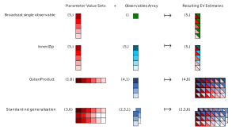

# Extended Estimator Interface

| **Status**        | **Proposed/Accepted/Deprecated** |
|:------------------|:---------------------------------------------|
| **RFC #**         | 0015                                         |
| **Authors**       | Ian Hincks (ian.hincks@ibm.com)              |
| **Deprecates**    | RFC that this RFC deprecates                 |
| **Submitted**     | YYYY-MM-DD                                   |
| **Updated**       | YYYY-MM-DD                                   |


## Summary <a name="summary"></a>
The current `Estimator.run()` method requires that a user provide one circuit for every observable and set of parameter values that they wish to run.
(This was not always the case, but the history will not be discussed here.)
It is common, if not typical, for a user to want to estimate many observables corresponding to a single circuit. Likewise, it is common, if not typical, for a user to want to supply multiple parameter value sets for the same circuit.
This RFC proposes to fix these issues by changing the `Estimator.run()` in the following ways: 

 1. Take the transpose of the current signature; rather than accepting `circuits`, `parameter_values`, and `observables` as three different (iterable) arguments which are to be zipped together, instead localize the distinct tasks to be run via an iterable of triples `(circuit, parameter_values, observables)`.
 2. In combination with 1, extend `parameter_values` and `observables` to be array-valued, that is, add the ability to explicity and conveniently specify multiple parameter value sets and observables for a single circuit.

## Motivation <a name="motivation"></a>

Here is a summary of pain-points with the current `Estimator.run()` interface:

1. _Ergonomics._ It feels unnatural to invoke the estimator as `Estimator.run([circuit, circuit], observables=[obs1, obs2])` because of the redundancy of entering the circuit twice. 

1. _Trust._ The case `Estimator.run([circuit, circuit], observables=[obs1, obs2])` makes a user question whether the primitive implementation is going to do any optimizations to check if the same circuit appears twice, and if so, whether it will be done by memory location, circuit equality, etc.; the interface itself creates gap in trust.

1. _Clarity._ Without reading the documentation in detail, it's not obvious that the invocation `Estimator.run([circuit], observables=[obs1, obs2])` wouldn't cause `circuit` to be run with both supplied observables. In other words, that zipping _is always what's done to the `run()` arguments_ is common source of user confusion. Conversely, it's not clear that the way to collect all combinations of two observables and two parameter sets is to invoke `Estimator.run([circuit] * 4, observables=[obs1, obs2] * 2), parameter_values=[params1] * 2 + [params2] * 2`.

1. _Performance._ Given that `QuantumCircuit` hashing should be avoided and circuit equality checks can be expensive, we should move away from an interface that necessitates performant primitive implementations to go down this path. As one example, qubit-wise commuting observables like `"IZZ"` and `"XZI"` can both be estimated using the same simulation/execution, but only if the estimator understands that they share a base circuit. As a second example, when the circuits need to be seriazed before they are simulated/executed (e.g. runtime or pickling-for-multi-processing), it puts the onus on the primitive implementation to detect circuit duplications.
   

Here is why the [Detailed Design](#detailed-design) section suggests "transposing" the signatureß and using array-based arguments with broadcasting:

 1. Transposing the signature will make it obvious what the primitive intends to do with each circuit.
 2. Transposing the signature will let us introduce and reason about the notion  "primitive unit of work", and carry it to other primitives.
 3. Array-based arguments will let users assign operational meaning to each axis (this axis is for twirling, that axis is for basis changes, etc.).
 4. Broadcasting rules will let users choose how to combine parameter value sets with observables in different ways, such as
    1. use one observable for all of N parameter value sets
    2. use one parameter value set for all of N observables
    3. zip N parameter value sets against N observables
    4. take all NxM combinations of N parameter value sets with M observables
    5. etc.

## User Benefit <a name="user-benefit"></a>

All users of the primitives stand to benefit from this proposal.
Immediately, it will enable sophisticated and convenient workflows for power users though arrays and broadcasting.
However, standard broadcasting rules are such that the 0D and 1D cases will feel natural to existing users---0D is essentially what we already have, and 1D will be perceived as a simple-yet-welcome bonus.

For all users, the interface changes in this proposal will enable specific primitive implementations to enhance performance through reduced bandwidth on the runtime, compatibility with fast parameter binding, and multiplexing qubit-wise commuting observables.

## Design Proposal <a name="design-proposal"></a>

### Tasks <a name="tasks"></a>

In this proposal, we introduce the concept of a Task, which we define as a single circuit along with auxiliary data required to execute the circuit relative to the primitive in question. This concept is general enough that it can be used for all primitive types, current and future, where we stress that what the “auxiliary data” is can vary between primitive types. 

For example, a circuit with unbound parameters (or in OQ3 terms, a circuit with inputs) alone could never qualify as a Task for any primitive because there is not enough information to execute it, namely, numeric parameter binding values. On the other hand, conceptually, a circuit with no unbound parameters (i.e. an OQ3 circuit with no inputs) alone could form a Task for a hypothetical primitive that just runs circuits and returns counts. This suggests a natural base for all Tasks:

```python
BaseTask = NamedTuple[circuit: QuantumCircuit]
```

For the `Estimator` primitive, in order to satisfy the definition as stated above, we propose the task structure

```python
ObservablesTask = NamedTuple[
    circuit: QuantumCircuit, 
    parameter_values: BindingsArray, 
    observables: ObservablesArray
]
```

We expect the formal primitive API and primitive implementations to have a strong sense of Tasks, but we will not demand that users construct them manually in Python as they are little more than named tuples, and we do not wish to overburden them with types. This is discussed further in [Type Coersion Strategy](#type-coercion-strategy).

### BindingsArray <a name="bindingsarray"></a>

It is common for a user to want to do a sweep over parameter values, that is, to execute the same parametric circuit with many different parameter binding sets. `BindingsArray` specifies multiple sets of parameters that can be bound to a circuit. For example, if a circuit has 200 parameters, and a user wishes to execute the circuit for 50 different sets of values, then a single instance of `BindingsArray` could represent 50 sets of 200 parameter values. Moreover, it is array-like (see [ObservablesArray](#observablesarray)), so in this example the `BindingsArray` instance would be one-dimensional and have shape equal `(50,)`. 

We expect the formal primitive API and primitive implementations to have a strong sense of `BindingsArray`, but we will not demand that users construct them manually because we do not wish to overburden them with types, and we need to remain backwards compatible. This is discussed further in the [Type Coercion Strategy](#type-coercion-strategy) and [Migration Path](#migration-path) sections.

The "BindingsArray" object will support, at a minimum, the following constructor examples for a circuit with three input parameters `a`, `b`, and `c`, where we will use `<>` to denote some `array_like` of the specified shape:

```python
# specify all 50 binding parameter sets in one big array
BindingsArray(<50, 3>) 

# specify bindings separately for each parameter, required if they have different types
BindingsArray([<50>, <50>, <50>]) 

# include parameter names with the arrays, where parameters can be grouped together in tuples, or supplied separately
BindingsArray(kwargs={(a, c): <50, 2>, b: <50>}) 

# “args” and “kwargs” can be mixed
BindingsArray(<50, 2>, {c: <50>}) 
```

Note that `BindingsArray` is somewhat constrained by how `Parameters` currently work in Qiskit, namely, there is no support for array-valued inputs in the same way that there is in OpenQASM 3; `BindingsArray` assumes that every parameter represents a single number like a `float` or an `int`.

### ObservablesArray <a name="observablesarray"></a>

With the `Estimator`, it is common for a user to want to estimate many observables of a single circuit. For example, all weight-1 and weight-2 Paulis that are adjacent on the connectivity graph. For a one-hundred qubit device, this corresponds to hundreds of unique estimates to be made for a single circuit, noting that for this particular example, on the heavy-hex graph, in the absence of mitigation, only 9 circuits need to be physically run.

The `ObservablesArray` object will be an object array, where each element corresponds to a observable the user wants an estimated expectation value of. It is up to an `Estimator` implementation to solve a graph coloring problem to decide how to produce a sufficient set of physical circuits that are capable of producing data to make each of these estimates.

### Arrays and Broadcasting <a name="arrays-and-broadcasting"></a>

An `nd-array` is an object whose elements are indexed by a tuple of integers, where each integer must be bounded by the dimension of that axis. The tuple of dimensions, one for each axis, is called the shape of the `nd-array`. For example, 1D list of 10 objects (typically numbers) is a vector and has shape `(10,)`; a matrix with 5 rows and 2 columns is 2D and has shape `(5, 2)`; a single number is 0D and has an empty shape tuple `()`; an `nd-array` with shape (20, 10, 5) can be interpreted as a length-20 list of 10×5 matrices.

Here are some examples of common patterns expressed in terms of array broadcasting, and their accompanying visual representation in the figure below:

```python
# Broadcast single observable
parameter_values = np.array(1.0)
parameter_values.shape == ()
observables = ObservablesArray([Pauli("III"), Pauli("XXX"), Pauli("YYY"), Pauli("ZZZ"), Pauli("XYZ")])
observables.shape == (5,)
>> result_bundle.shape == (5,)

# Inner/Zip
parameter_values = BindingsArray(np.random.uniform(size=(5,)))
parameter_values.shape == (5,)
observables = ObservablesArray([[Pauli("III")], [Pauli("XXX")], [Pauli("YYY")], [Pauli("ZZZ")], [Pauli("XYZ")]])
observables.shape == (5,1)
>> result_bundle.shape == (5,)

# Outer/Product
parameter_values = BindingsArray(np.random.uniform(size=(1,6)))
parameter_values.shape == (1,6)
observables = ObservablesArray([[Pauli("III"), Pauli("XXX"), Pauli("YYY"), Pauli("ZZZ"), Pauli("XYZ"), Pauli("IIZ")]])
observables.shape == (4,1)
>> result_bundle.shape == (4,6)

# Standard nd generalization
parameter_values = BindingsArray(np.random.uniform(size=(3,6)))
parameter_values.shape == (3,6)
observables = ObservablesArray([
    [[Pauli(...), Pauli(...)]],
    [[Pauli(...), Pauli(...)]],
    [[Pauli(...), Pauli(...)]]
])
observables.shape == (3,1,2)
>> result_bundle.shape == (3,2,6)

```



FAQ1: Why make `BindingArrays` `nd`, and not just `list`-like? 

* A1: The primitives are meant to be a convenient execution framework, and allowing multiple axes relieves certain book-keeping burdens from the caller. `nd-arrays` are a standard construct in data manipulation. Different axes can be assigned different operational meanings, for example axis 0 could be a sweep over basis transformations, and axis 1 could be a sweep over Pauli randomizations.

* A2: There are different places in the runtime stack that binding can occur. in the runtime container, as a fast parametric. Having multiple axes gives us the freedom to offer this as an explicit feature in the future (?).

* A3: It lets us specify certain common scenarios for `ObservablesTask` more efficiently. For example, suppose we want one axis to represent twirling variates, and the other axis to represent observable bases. Then, via broadcasting, described below, the information that needs to be transferred over the wire appears 1D  for both the twirling variate phase information and the list of observables. Without `nd-array` support, broadcasting would have to be done client-side.

We propose that any subtype of `ArrayTask` use broadcasting rules on auxillary data.

### Primitive Interface <a name="primitive-interface"></a>

We use the (non-standard) notation that `Type<attrs>` denotes an instance of the given type with a constraint on attributes such as shape or format.

```python
Estimator.run(Union[Iterable[ObservablesTask<shape_i>], ObservablesTask], **options) → List[ResultBundle<{evs: ndarray<shape_i>, stds: ndarray<shape_i>}>]
```

Example:

```python
circuit = QuantumCircuit # with 2039 parameters

parameter_values = np.random((9, 32, 2039))
observables = [<list of 9 different paulis>]
job = estimator.run((circuit, parameter_values, observables))

job.result()

>> [ResultBundle<{evs: ndarray<9, 32>, stds: ndarray<9, 32>}>, metadata]

Sampler.run(Union[Iterable[ArrayTask<shape_i], ArrayTask]) -> List[ResultBundle[{creg_name: CountsArray}]]
```

### Type Coercion Strategy <a name="type-coercion-strategy"></a>

To minimize the number of container types that an every-day user will need to interact with, and to make the transition more seamless, we propose that several container types be associated with a `TypeLike` pattern and a static method

```python
def coerce(argument: TypeLike) -> Type
```

that is invoked inside of the `run()` method.

For example,

```python
BindingsArrayLike=Union[BindingsArray, ArrayLike, Iterable[float], Mapping[Parameter, float]]
```

and

```python
@staticmethod
def coerce(bindings_array: BindingsArrayLike) -> BindingsArray:
    if isinstance(bindings_array, (list, ArrayLike)):
        bindings_array = BindingsArray(bindings_array)
    elif isinstance(bindings_array, Mapping):
        bindings_array = BindingsArray([], bindings_array)

    return bindings_array
```

In particular, we propose this kind of Coercion for the types:
* `ArrayTask`
* `ObservablesTask`
* `BindingsArray`
* `ObservablesArray`

### ResultBundles <a name="resultbundles"></a>

The results from each `Task` will be array valued. However, we may require several arrays, possibly of different types. Consider an `ObservablesTask` with shape `<20, 30>`, where the shape has come from some combination of multiplexing an observables sweep with a parameter values sweep. This will result in a 20×30 array of real estimates. Moreover, we will want to return an array of standard deviations of the same shape. This would result in a bundle of broadcastable arrays:

```python
ResultBundle({“evs”: <20, 30>, “stds”: <20, 30>}, metadata)
```

The reason we are proposing a generic container for the return type instead of, e.g., an `Estimator`-specific container, is because

1. Provides unified experience across primitives for users. 
1. code-reuse
1. Provides a certain certain amount of flexibility for what can be returned without modifying the container object. Here are some examples:
  1. Suppose that we want to give users the option of additionally returning the covariances between estimates that arise because of the circuit multiplexing, then we could update with the field `{"cov": <20,30,20,30>}`.
  1. Suppose we want to return some indication of which estimates came from the same physical circuit.

## Detailed Design <a name="detailed-design"></a>
Technical reference level design. Elaborate on details such as:
- Implementation procedure
  - If spans multiple projects cover these parts individually
- Interaction with other features
- Dissecting corner cases
- Reference definition, e.g., formal definitions.

## Migration Path <a name="migration-path"></a>

We need to remain backwards compatible with the existing interface to adhere to the [Qiskit Deprecation Policy](https://qiskit.org/documentation/deprecation_policy.html). Notice that for both `Sampler` and `Estimator`, the first argument of the `run()` call will either contain `Tasks` (or `TaskLike`s) or it won’t.

We propose a migration strategy based on this: If the user has provided no `TaskLike`s, proceed with the old API and old API output and emit a deprecation warning, or an error if something mandatory like `observables` has been omitted. Otherwise, proceed with the new API, raising if they have tried to use the old arguments in addition to providing tasks.

```python
def run(
        self,
        circuits: Sequence[QuantumCircuit] | QuantumCircuit,
        observables: Sequence[BaseOperator | PauliSumOp | str] | BaseOperator | PauliSumOp | str,
        parameter_values: Sequence[Sequence[float]] | Sequence[float] | float | None = None,
        **run_options,
    )
```

```python
def run(self, tasks, observables=None, parameter_values=None, **run_options):
    has_tasks = isinstance(tasks, QuantumCircuit) or all(isinstance(task, QuantumCircuit) for task in tasks)

    if not has_tasks:
        # Trigger old API and disallow new one
        if not all_circuits:
            raise ValueError("Cannot mix and match old API with new API")

        if observables is None:
            raise ValueError("`observables` is required argument in the old API")

        circuits = [tasks] if isinstance(tasks, QuantumCircuit) else tasks
        observables = [observables] is isinstance(observables, (BaseOperator, PauliSumOp, str)) else observables
        tasks = zip(circuits, observables, parameter_values)
        warnings.warn(<deprecation>)
    tasks = ObservableTask.coerce(task) for task in tasks

    return self._run_old_api(...) if no_tasks else return self._run(...)
```

## Alternative Approaches <a name="alternative-approaches"></a>

An alternative is to consider letting the `run()` method accept, effectively, only a single `ObservablesTask`:

```python
Estimator.run(cirucuit, parameter_values_array, observables_array)
```

This has the advantage of a simpler interface, where multiple tasks could be run 
by invoking the estimator multiple times. The disadvantages, which we feel are significant enough to forego this simplification, are that:

 1. For real backends, the user would lose the ability to cause multiple types of circuits to be loaded into the control hardware at one time. For example, if using an estimator to perform randomized benchmarking, each circuit depth would need to be a separate job.
 2. It would be difficult for implementations that include mitigation to share resources between tasks. For example, if different tasks represent different trotter step counts, there would need to be a complicated mechanism to share learning resources---that are specific to the application circuits---between multiple jobs.

## Questions <a name="questions"></a>
Open questions for discussion and an opening for feedback.

## Future Extensions <a name="future-extensions"></a>

In this proposal we have typed circuits as `QuantumCircuit`. It would be possible to extend this to a `CircuitLike` class which could be as simple as `Union[QuantumCircuit, str]` to explicitly allow OpenQASM3 circuits as first-class inputs.

A consequence of switching to the concept of Tasks (mentioned in [Tasks](#tasks)) is that this will allow us to introduce the `.run()` method into `BasePrimitive`

```python
class BasePrimitive(ABC, Generic[T]):
    ...
    def run(self, T | Iterable[T], **options) -> List[ResultBundle]:
        ...
```