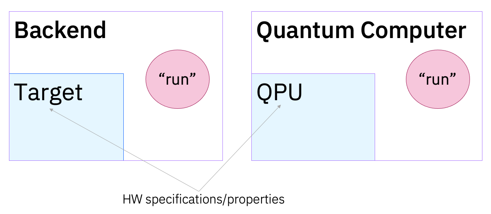
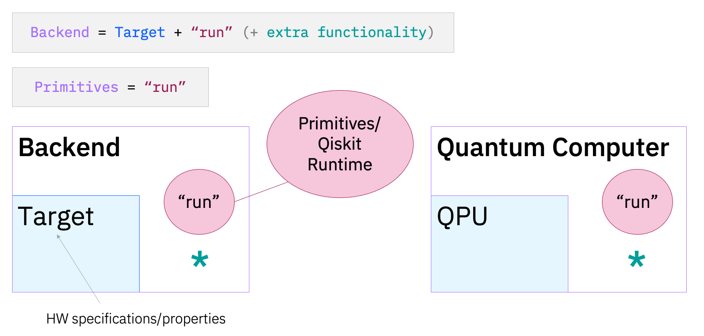
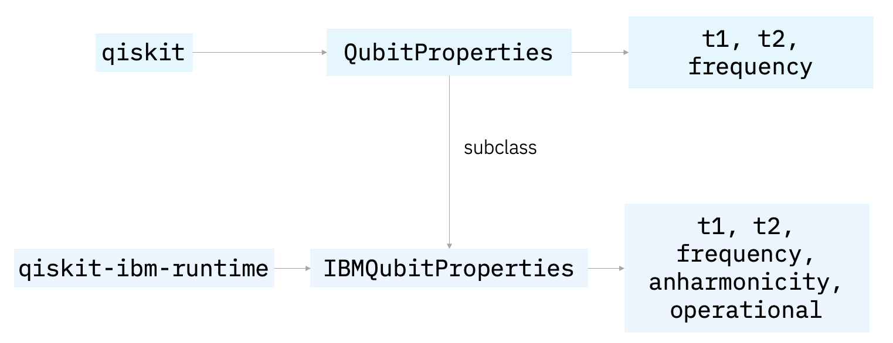

# BackendV3

| **Status**        | **Proposed/Accepted/Deprecated** |
|:------------------|:---------------------------------------------|
| **RFC #**         | ####                                         |
| **Authors**       | Elena Peña Tapia (ept@zurich.ibm.com), Matthew Treinish (matthew.treinish@ibm.com)   |
| **Deprecates**    | RFC that this RFC deprecates                 |
| **Submitted**     | YYYY-MM-DD                                   |
| **Updated**       | YYYY-MM-DD                                   |

## Summary
Backends are the "de facto" abstractions for quantum devices in the Qiskit ecosystem, extending beyond a simple combination of their components. The current Qiskit backend model, however, clashes with the execution model of primitives. This is a proposal to add a new `BackendV3` class that fills the gap in the current Qiskit backend + execution model.

> Instead of a required `backend.run()`, the proposal for `BackendV3` implementations is to offer **primitive factory methods**: `backend.sampler()` and `backend.estimator()` that return their respective instantiated primitive classes, as well as an optional `backend.run()` for 3rd party and local simulation backends (for backwards compatibility and testing, up to discussion).

For example, for `qiskit-ibm-runtime`, we could have:

```python
from qiskit_ibm_runtime import QiskitRuntimeService

service = QiskitRuntimeService()
backend = service.backend("ibm_fez")
estimator = backend.estimator(mode="batch", options={"shots":1024})
```

instead of:
```python
from qiskit_ibm_runtime import QiskitRuntimeService, Estimator

service = QiskitRuntimeService()
backend = service.backend("ibm_fez")
estimator = Estimator(backend=backend, mode="batch", options={"shots":1024})
```

This document lays out the different design options considered in details such as primitive version handling or migration tradeoffs. 

## Motivation

### Why are we doing this? (With a bit of History)

The Qiskit `Backend` object was originally introduced to provide an abstract model of a **physical quantum computer**, enabling software to interact with it. There are two key types of interaction with a `Backend`:

1. **Transpilation** -> "we need to access hardware constraints to optimize circuits (to run on a QPU)"
2. **Execution** -> "we need an interface for sending circuits to the QPU and receiving an output"

The original `Backend` interface was `BaseBackend` (i.e. `BackendV0`), designed primarily for execution, the most fundamental ("basic") interaction with quantum computers. `BaseBackend` took a legacy `qobj` object as an input on `.run()` and  was explicitly tied to the IQX API formats. The next iteration of the interface was `BackendV1`, which improved the interface by decoupling the Python code from IBM's REST API payload format to allow changes on either side (although no actual changes were made at the time, which facilitated the migration), and removing the use of `qobj` in `.run()` (opting for `QuantumCircuit` instead). The need for improved transpilation support led to the introduction of `BackendV2`, and incorporating an abstraction for the "QPU", the `Target`. 

> A lesson learned from the `BaseBackend -> BackendV1` and `BackendV1 -> BackendV2` migrations is that the first one was substantially easier and cleaner to implement because of the reduced amount of changes.  Changing too much at once makes it exponentially harder to get dependencies to migrate. Keeping changes small and not breaking existing implementations so the migration is trivial is a better way to evolve the interface.



A few years later, the `Sampler` and `Estimator` **primitives** were introduced. Instead of an abstraction for a physical object (the quantum computer) or a part of it (the QPU), the primitives introduced a higher level of abstraction for the two most common **tasks** or **access patterns** executed in quantum computers, these are: sampling from a state (defined as a circuit) and computing expectation values from observables on states. These were developed as standalone entities, independent of the `Backend` model, but effectively replaced the original backend implementation of the execution step, the famous `backend.run`. 



The image above summarizes the current superposition of the backend and primitives models at the execution ("run") step. This "unresolved superposition" between the backend and the primitives model disrupts the design and development process around backends and primitives. What's allowed and not allowed is not clear. There are multiple backend providers and primitive implementations (`qiskit`, `qiskit-ibm-runtime`, `qiskit-aer`, external providers), and users struggle to figure out what primitive to use, what backend to use, how do they interact with each other... On top of this, current backend implementations (such as the `IBMBackend`) do not respect the guidelines of their original abstract interface. This is the motivation for introducing a new `BackendV3` that better reflects the status quo but respects the essence and usability of the original backend proposal.

Before diving into the specifics of the `BackendV2` design (current status) and its interaction with the primitives model, it's important to note that the `Backend` interface was designed with two broader goals:

1. Providing a interface general enough to support any vendor (**vendor-agnostic**)
2. Setting a level of abstraction that allows the **physical hardware to evolve** without affecting the abstract object

Both these goals have been fulfilled, with a growing list of 3rd-party providers that consume the `Backend` interface, which has seamlessly supported hardware changes in basis gates, couplers, noise definitions, introduction of qubit resets, and more. The goal for `BackendV3` is to maintain these design principles.

### What will be the outcome?

A new `BackendV3` class. This class should be almost 100% backwards-compatible with the current transpilation stack (for which it must contain a `Target`), but not require a `.run` method, and instead provide primitive-friendly alternatives.

Instead of a required `backend.run()`, the proposal for `BackendV3` implementations is to offer **primitive factory methods**: `backend.sampler()` and `backend.estimator()` that return their respective instantiated primitive classes (details TBD), as well as an optional `backend.run()` for 3rd party and local simulation backends (up to discussion).

## User Benefit
- For devs: 
  - A unified model that reflects our vision for quantum computers from the software abstraction point of view.
  - An abstract interface that doesn't contradict our product guidelines
  - Reduced documentation effort, as the backend "guides" what primitive object to use
- For users: 
  - A better understanding of what primitives are and how they fit into our vision and stack.
  - Lower entry barrier for primitives: 
    - do the same with less code, less imports
    - switching between providers is easier (just change backend)
    - no need to ask can I use this primitive with that backend? (because the backend gives you the primitive)

## Design Proposal
<!-- This is the focus of the document. Explain the proposal from the perspective of
educating another user on the proposed features.

This generally means:
- Introducing new concepts and nomenclature
- Using examples to introduce new features
- Implementation and Migration path with associated concerns
- Communication of features and changes to users

Focus on giving an overview of impact of the proposed changes to the target
audience. -->

### BackendV2 - the existing backend model

IBM Quantum uses the following definitions:

- **QPU:** “A QPU includes all of the hardware responsible for accepting an executable quantum instruction set, or a quantum circuit, and returning an accurate answer”

- **Quantum Computer:** QPU + infrastructure to run tasks on it

According to the `BackendV2` interface, the QPU is represented by the `Target` class, and the quantum computer is the `BackendV2`. A simple formula for `BackendV2` would be:

```
BackendV2 = Target + .run + "extra functionality"
```

Where `Target + .run` are **required** components, and `"extra functionality"` comprises both optional and custom functionality that can be used to extend the backend model and adapt it using provider-specific information. 

The initial proposal in this RFC is to **maintain** the `BackendV2` design of the Target and extra functionality (up to small changes), and focus on improving the "run" component. The detailed design section expands on what each component involves.

### BackendV3 - the new backend model

Instead of a required `backend.run()`, the proposal for `BackendV3` implementations is to offer **primitive factory methods**: `backend.sampler()` and `backend.estimator()` that return their respective instantiated primitive classes. These factory methods should be defined in the abstract `BackendV3` interface and it's up to the provider to decide what "flavor" of primitive will be returned in their specific `BackendV3` subclass. 

The abstract definition of factory methods should be: 

- as minimal as possible without being trivial
- agnostic to the primitive interface version (to support both current and future versions of the primitives)

We could additionally still maintain an optional `backend.run()` for 3rd party and local simulation backends.

This sums up the change from having one mandatory implementation of the execution step (`.run()`) to having three optional implementations: 

- `.sampler()`
- `.estimator()`
- `.run()`

Important design questions include:

1. **Required vs optional**

`BackendV2` only offered 1 required execution method `.run()`. With `BackendV3`, there are 3 paths for execution: should we make them all optional and not require backends to implement the "run" component? Should we require at least a `.sampler()` or a `.estimator()` method (which return a primitive and don't actually execute)?

Making all 3 methods optional seem like the best choice because of its flexibility: it enables all three execution options as well as an "execution-less" backend object that only exposes a model for compilation (transpilation). This can be different from just using a `Target` because of the additional functionality backend implementations provide.

2. **The role of .run, why is it valuable** 

The role of `run()`, as defined in `BackendV2` often gets immediately translated to "return counts", which is more restrictive than what the interface dictates. `run()` is designed to be free form, the only requirements are that the input is  a `QuantumCircuit` and the output is a `Result`. `Result` is purposely unrestricted, there are no requirements on the data it contains and the implementation details are left up to the implementer/vendor. There is a bias/convention towards returning `Counts` per circuit input in the job for historical reasons, and there are some formatting expectations if using those count mechanisms. But the output of `.run()` doesn't have to be "counts". 

`qiskit-aer` is a good example of vendor that uses the flexibility of `Result`, as it attaches other circuit output in the result object. This can be done with various custom `Save*` instructions like `SaveExpectationValue` or `SaveStatevector` that attach extra data fields for the result of these save instructions.

This flexibility differs from the primitives, which are prescriptive in how the execution runs and the result formats, and is one of the reasons why we suggest **extending** the backend interface with primitive factories instead of, from an abstract interface/modelling perspective, **replacing .run** with them (important: making them all optional allows for implementers to **choose** whether to take advantage of the `.run` method or not). They serve different purposes, one is a generic execution method that can be implemented to fit a specific use case, the other is a "bridge" between execution models that connects backend with primitives.

3. **Primitive versioning approaches** 

The primitives interface is currently developed and versioned independently to the backend interface, and providers typically implement a single primitives version per release. The purpose of `BackendV3` is to bridge the gap between models, which requires a new versioning strategy, for which there are 3 options:

  1. Prescriptive versioning ("primitives style"): tie a backend version to a primitive interface version, so for example `BackendV3.sampler() -> SamplerV2`.  If/when there is a `SamplerV3` we have to make a `BackendV4` to bump the return type to use `SamplerV3`. The pros of this alternative could be intuitiveness. But the cons are: increased maintenance effort, increased migration effort for downstream providers. This alternative seems to contradict the stability/adaptability principle that has allowed previous backend implementations to succeed.

  2. Open ended versioning: say that the `BackendV3.sampler() -> Sampler` where it is any version and leave it up to the user to handle the version management.

  3. Method versioning: being prescriptive in the method `backend.sampler_v2() -> SamplerV2`

-----
Factors to consider:
- Performance
- Dependencies
- Maintenance
- Compatibility

## Detailed Design

This section traverses in more detail Let's traverse the different components of `BackendV2` how they would look like in `BackendV3`:

#### 1. The Target (will not change in BackendV3)

>`BackendV3` should still expose a `backend.target` attribute in the same fashion as `BackendV2`. This will return a `Target` instance.

The `Target` class is a container for the different hardware specifications that model a QPU. It was modelled following the requirements of the Qiskit transpiler. It's designed to be vendor-agnostic, but allows for vendor-specific extensions.

The `Target` defines 3 categories of information in its attributes:

1. **Required:** necessary to define a fundamental instance. Qiskit (and in particular, the transpiler) relies on their definition. These are:
    - number of qubits
    - supported instructions, as tuples of `(instruction, qargs)`

2. **Optional:** this information is not necessary, but if provided, Qiskit will offer tools to leverage this information and reason about it. These are:
    - `QubitProperties` 
    - `InstructionProperties` (error rate, duration) associated to a tuple of `(instruction, qargs)`
    - Global timing and alignment information
  
3. **Custom:** custom attributes are vendor-specific extensions, and Qiskit does not offer tools to handle this information. They can be defined by subclassing. For example: the `IBMBackend` implementation of `BackendV2` subclasses `QubitProperties` to add new vendor-specific fields:



All Qiskit transpiler passes support `Target` instances as an input and all out-of-the-box transpiler passes know how to use required and optional information in the target. Custom information can be handled through custom transpiler passes. 

#### 2. The `.run` method (will change in BackendV3)

The abstract interface definition of `BackendV2` requires that subclasses implement a `.run` method for execution, the following table shows some example of `BackendV2` implementations where the `.run` method plays an important role:

|   Backendv2                            | Target                                                      | .run                                          |
|--------------------------------------|-------------------------------------------------------------|-----------------------------------------------|
|   `GenericBackendV2` (qiskit)          |   Customizable: built in backend init following user inputs | Calls `BasicSimulator.run` or `AerSimulator.run`  |
|   `FakeBackendV2` (qiskit-ibm-runtime) |   Built from historical IBM hardware information (json)     | Calls `BasicSimulator.run` or `AerSimulator.run`  |
|      `IBMBackend` (qiskit-ibm-runtime) |   Built from current IBM hardware information (json)        | Disabled (used to access real HW)             |
| `AerSimulator` (qiskit-aer)            |   Defined by user, built from noise model or default        | Proprietary implementation of local simulator |
| `AQTResource` (qiskit-aqt-provider)    |   AQT target                                                | 3rd-party AQT ion-trap system                 |
                             
`.run` used to be the public API for accessing IBM Quantum hardware, but this is no longer the case. Public access through `.run` has been revoked, and current backends in `qiskit-ibm-runtime` only support access through the `Sampler.run` and `Estimator.run` methods.

Instead of a required `backend.run()`, the proposal for `BackendV3` implementations is to offer **primitive factory methods**: `backend.sampler()` and `backend.estimator()`. 

#### 3. Extra functionality (small changes in BackendV3)

As mentioned initially, this category includes both optional and custom functionality that is currently present in `BackendV2` implementations. The difference between optional and custom is that Qiskit offers tools to reason about optional functionality, while custom functionality requires custom tools to handle it (similar philosophy to the `Target` class).

**Optional Functionality** -> `QubitProperties`

For historical reasons, `QubitProperties` remains an optional property on both the `Target` and `BackendV2` objects. This adds redundancy and ambiguity, as any functionality that uses `QubitProperties` must query both and establish rules on what takes precedence over what. This can be easily fixed in `BackendV3` by no longer storing `QubitProperties` in the backend, and keeping them exclusively as an optional `Target` property. Querying these properties would still be possible in `BackendV3` for backwards compatibility by aliasing the target query.

**Optional Functionality** -> Transpiler hooks

The Qiskit transpiler accepts backend hooks for custom translation and scheduling methods. These hooks replace the default plugins used by the preset pass manager pipeline, and they are useful for backends with constraints that are not expressible via Target. 
There are currently two hook options, enabled by the `get_translation_stage_plugin()` and `get_scheduling_stage_plugin()` methods.


For example, `IBMBackend` exposes the following hook to handle fractional gate support, that overwrites the default translation plugin with either `"ibm_dynamic_circuits"` or `"ibm_fractional"`.

```python
class IBMBackend(...):
  ...
  def get_translation_stage_plugin(self) -> str:
    """Return the default translation stage plugin name for IBM backends."""
    if not self.options.use_fractional_gates:
      return "ibm_dynamic_circuits"
    return "ibm_fractional"
```

**Custom Functionality** -> Custom attributes

Custom attributes allow to extend the Target representation with vendor-specific information, and Qiskit does not provide tools to manipulate this information out-of-the-box.

For example, some custom attributes in `IBMBackend` are:

```
status
configuration
properties
parametric_pulses
credits_required
conditional_latency
processor_type
...
```

In principle, the changes in `BackendV3` should be restricted to the execution stage and not modify the extra functionality, unless there is a concrete gap to fill that hasn't already been considered.

## Alternative Approaches

The main alternative approach taken into consideration has ben defining a cleaner split between backend components (target vs execution) and "getting rid" of the backend abstraction. The following setbacks were found to justify following the `BackendV3` approach instead:

1. As mentioned in the introduction, the `Backend` object is more than the sum of its parts. It allows for the introduction of custom and optional functionalities that don't conceptually belong in the primitives or the target. For these functionalities that already exist, forcing their "redistribution" will lead to unintuitive outcomes that will impact users. These optional and custom attributes have been key to the flexibility of the model, it's thanks to these that we have been able to adapt backends to new iterations of the physical hardware.

2. The backend abstraction is not only natural/intuitive, it's well-established in our ecosystem. Removing it would be a considerable disruption for users and downstream devs, with no practical user benefit. Instead, `BackendV3` would be an almost additive change with little user impact.

## Questions
Open questions for discussion and an opening for feedback.

## Future Extensions
Consider what extensions might spawn from this RFC. Discuss the roadmap of
related projects and how these might interact. This section is also an opening
for discussions and a great place to dump ideas.

If you do not have any future extensions in mind, state that you cannot think
of anything. This section should not be left blank.
